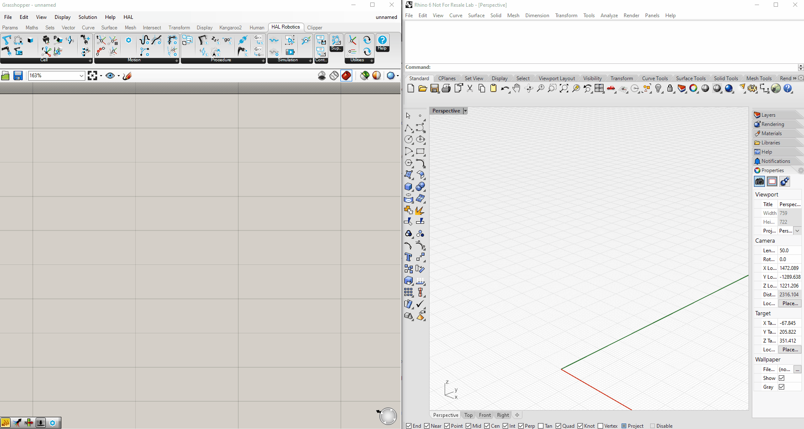
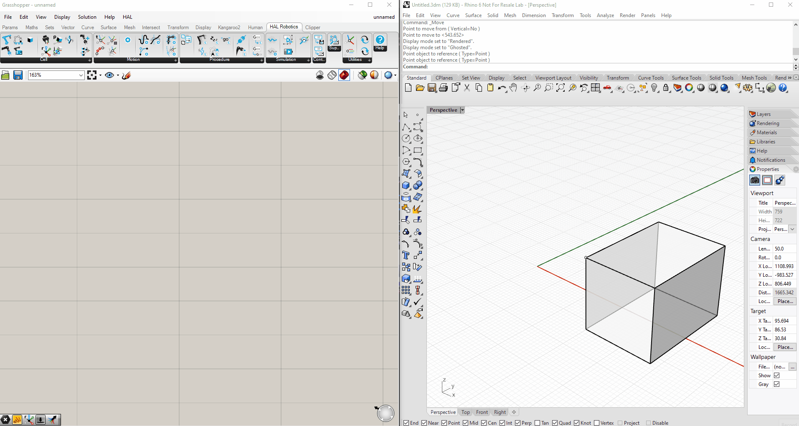
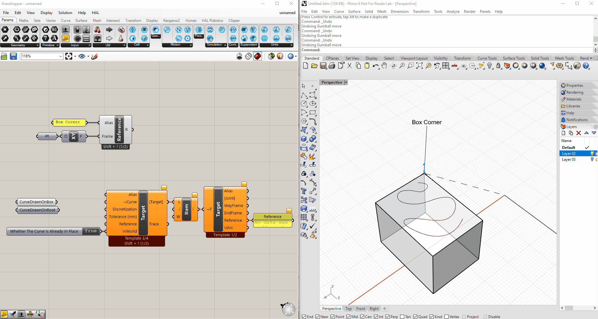
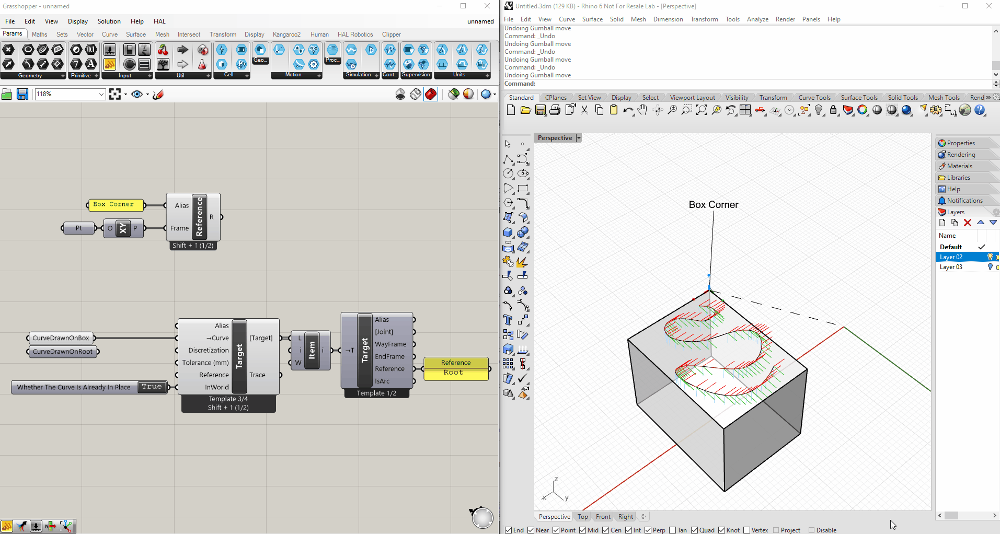
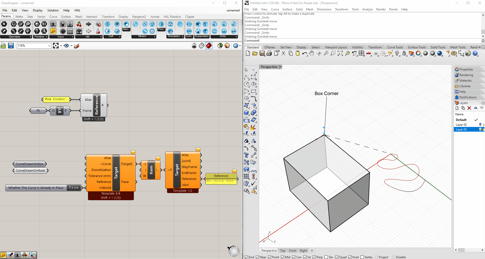
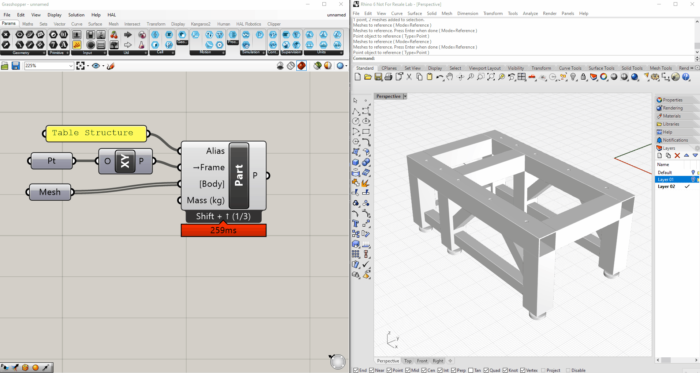
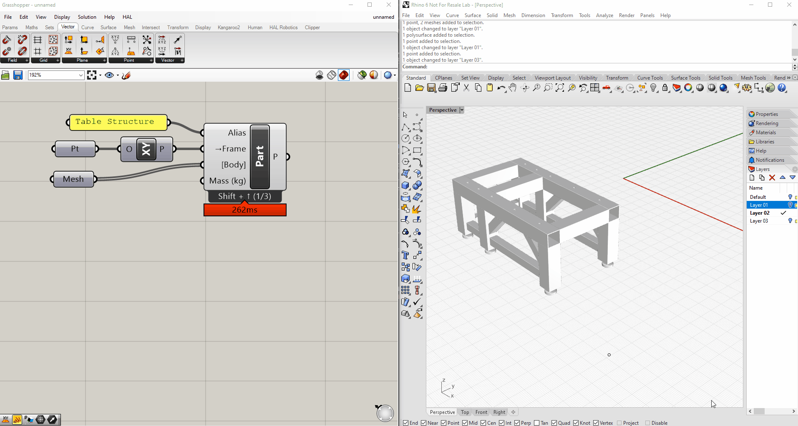
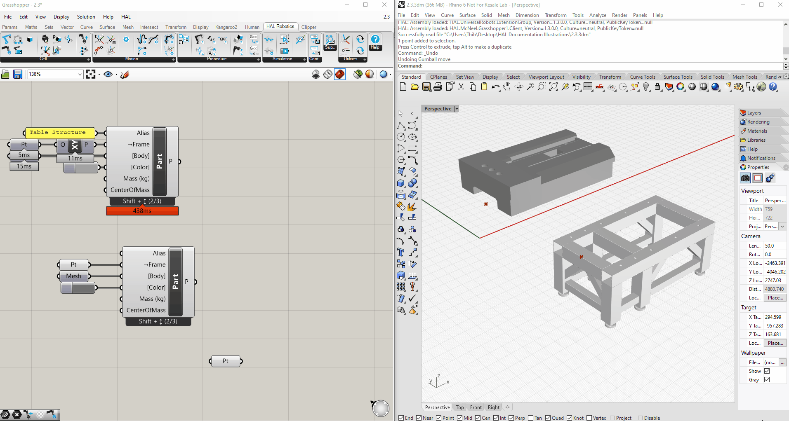

## 2. Cell

[2.1. Insert a Robot](#21-insert-a-robot)

[2.2. Create a Reference](#22-create-a-reference)

[2.3. Create a Part](#23-create-a-part)

[2.4. Create a Tool](#24-create-a-tool)

[2.5. Calibrate a Reference or Tool](#25-calibrate-a-reference-or-tool)

[2.6. Create a Multi-Part Tool](#26-create-a-multi-part-tool)

[2.7. Create a Positioner](#27-create-a-positioner)

[2.8. Save a Mechanism as a Preset \[Coming Soon\]](#28-save-a-mechanism-as-a-preset)

---
### 2.1. Insert a Robot

#### Objective:

In this quick tutorial we'll take a look how to insert a **Robot** preset in the HAL Robotics Framework for Grasshopper.

#### Requirements to follow along:

- [McNeel's Rhinoceros 3D and Grasshopper](https://www.rhino3d.com/download), and the HAL Robotics Framework installed on a PC.

#### How to:

Within the **HAL Robotics** tab, under the **Cell** panel you will find a component called **Robot**. When you place this in the document you will notice that it has two interlocking squares **⧉** in its name. This is the symbol for a [pop-up window component](../1-Getting-Started/Contents.md#13-components) meaning we can double click on the component to bring up an additional user interface. In this case that's a catalog listing all of the available [Robots](../../Overview/Glossary.md#manipulator) we've pre-created for your immediate use. 

You can use the search bar or tags listed on the left-hand side of the window to filter the [Robots](../../Overview/Glossary.md#manipulator) to find the one you want. Once you have identified the [Robot](../../Overview/Glossary.md#manipulator) you want to add to the document simply double click or use the "Select" button to instantiate your [Robot](../../Overview/Glossary.md#manipulator) in the scene. If you intend to [Export](../../Overview/Glossary.md#export) code to your [Robot](../../Overview/Glossary.md#manipulator) it is a good habit to name your virtual **Robot** to match the real one using the _Alias_ input. For example, the `IRB-1200` we have in the office is configured as `HAL_Jarvis`.

<em>It is good practice to name HAL objects by using the _Alias_ input of the components.</em>

---
### 2.2. Create a Reference

#### Objective:

In this tutorial we'll see how to create [References](../../Overview/Glossary.md#reference) in HAL Robotics Framework components in Grasshopper.

#### Demo Files:

> [  Create a Reference.gh](../ExampleFiles/Tutorials/2.2%20-%20Create%20a%20Reference.gh)

#### Requirements to follow along:

- [McNeel's Rhinoceros 3D and Grasshopper](https://www.rhino3d.com/download), and the HAL Robotics Framework installed on a PC.

#### Background:

[References](../../Overview/Glossary.md#reference) are useful because they allow us to specify [Targets](../../Overview/Glossary.md#target) relative to something other than the world or the base of the [Robot](../../Overview/Glossary.md#manipulator). This means that they can be recalibrated in the real world without the need to regenerate a [Toolpath](../../Overview/Glossary.md#toolpath) or [Procedure](../../Overview/Glossary.md#procedure).

#### How to:

The simplest way to create a [Reference](../../Overview/Glossary.md#reference) is under the **Cell** panel, **Create Reference**. Our [Reference](../../Overview/Glossary.md#reference) defaults to the world origin but you can equally select any point from your Rhino or Grasshopper session. In this demo I'm going to use this point on the corner of my box which I've previously drawn in Rhino. I'm going to bring that into Grasshopper and assign it as the origin of an XY Plane and the _Frame_ of my **Reference**. We can see the location of our [Reference](../../Overview/Glossary.md#reference) from these dashed axes with dots at the ends. You can also see that the [Reference](../../Overview/Glossary.md#reference) is labelled. To simplify finding our [References](../../Overview/Glossary.md#reference) later it's advisable to give them an identifiable name, in this case `BoxCorner`, using the _Alias_ input.

<em>It is good practice to name HAL objects by using the _Alias_ input of the components.</em>

There are two main ways to use [References](../../Overview/Glossary.md#reference), both of which can be demonstrated using the **Target** component and selecting the **From Curve** template. 
*   The first, default, way of using the [Reference](../../Overview/Glossary.md#reference) can be seen by simply selecting a curve already in position in the world. We can see that the [Targets](../../Overview/Glossary.md#target) all follow the curve as it is drawn, but if we drill down into the **Targets'** properties using the **Target Properties** component, we can see that their [References](../../Overview/Glossary.md#reference) are correctly set to `BoxCorner`. If, in this configuration, we move our [Reference](../../Overview/Glossary.md#reference) you'll see that the [Targets](../../Overview/Glossary.md#target) do not follow. That's because the parameter _InWorld_ is set to `true` meaning that both the [Targets](../../Overview/Glossary.md#target) and [Reference](../../Overview/Glossary.md#reference) are in their correct positions in the world and no modifications need to be made. 

<em>Targets created without reference will automatically have the world origin assigned as their reference. Their coordinates will be translated to robot code as they are.</em>

<em>Targets created with a reference but _InWorld_ will have the reference assigned but their location relative to the world origin won't change. Their coordinates relative to the reference will be translated to robot code.</em>

*   The other way of using the [References](../../Overview/Glossary.md#reference) is with geometry modelled relative to the world origin like this curve. If we set this up in the same way and change _InWorld_ to `false` our [Targets](../../Overview/Glossary.md#target) maintain the same relative transformation between the world origin and their new [Reference](../../Overview/Glossary.md#reference). Now when we move the [Reference](../../Overview/Glossary.md#reference) around, the relative [Targets](../../Overview/Glossary.md#target) follow.

<em>Targets created at the document origin then assigned to a reference, not _InWorld_, will follow the reference around the scene treating the reference as their new origin. Their coordinates relative to the reference will be translated to robot code.</em>

[References](../../Overview/Glossary.md#reference) can also be parented. If we create another [Reference](../../Overview/Glossary.md#reference) and use Shift + Up to change overload we can see a _Parent_ input appear and the same _InWorld_ parameter that we saw in **Target from Curve**. If we use our old [Reference](../../Overview/Glossary.md#reference) as the _Parent_ of this new [Reference](../../Overview/Glossary.md#reference), add a bit of an offset by assigning the _Frame_ and set _InWorld_ to `false` we now have a [Reference](../../Overview/Glossary.md#reference) referenced to a [Reference](../../Overview/Glossary.md#reference). We can reassign the [Reference](../../Overview/Glossary.md#reference) of our relative [Targets](../../Overview/Glossary.md#target) and see both the new [Reference](../../Overview/Glossary.md#reference) and our [Targets](../../Overview/Glossary.md#target) follow when `BoxCorner` is moved. This is of particular use if you have a calibrated work surface but want to perform work in different areas of it.

<em>References can be declared relative to each other.</em>

#### Next:

Take a look at the next tutorial on creating [Parts](../../Overview/Glossary.md#part) to learn how to add geometry to your [References](../../Overview/Glossary.md#reference).

---
### 2.3. Create a Part

#### Objective:

In this tutorial we'll see how to create [Parts](../../Overview/Glossary.md#part) using HAL Robotics Framework components in Grasshopper.

#### Demo Files:

> [  Create a Part.gh](../ExampleFiles/Tutorials/2.3%20-%20Create%20a%20Part.gh)

#### Requirements to follow along:

- [McNeel's Rhinoceros 3D and Grasshopper](https://www.rhino3d.com/download), and the HAL Robotics Framework installed on a PC.
- Reading or watching the [Create a Reference](../2-Cell/Contents.md#22-create-a-reference) tutorial is highly recommended.

#### Background:

[Parts](../../Overview/Glossary.md#part) serve two roles in the HAL Robotics Framework. Firstly, they can be used to populate your [Cells](../../Overview/Glossary.md#cell) with environmental elements such as pedestals, tables or tool holders which can in turn be used as [References](../../Overview/Glossary.md#reference) for your [Toolpaths](../../Overview/Glossary.md#toolpath). [Parts](../../Overview/Glossary.md#part) can also be used as the basis for creating your own [Mechanisms](../../Overview/Glossary.md#mechanism) such as [Robots](../../Overview/Glossary.md#manipulator), [Positioners](../../Overview/Glossary.md#positioner) or complex [Tools](../../Overview/Glossary.md#end-effector).

#### How to:

We can create a [Part](../../Overview/Glossary.md#part) by going to the **Cell** panel, **Create Part**. If you've seen the [Create a Reference](../2-Cell/Contents.md#22-create-a-reference) tutorial many of the inputs here will look familiar, in its simplest form a [Part](../../Overview/Glossary.md#part) is just a [Reference](../../Overview/Glossary.md#reference) with associated geometry. The _Frame_ of our [Part](../../Overview/Glossary.md#part) is its base frame, that is to say if you were to set the position of the [Part](../../Overview/Glossary.md#part) that is the point that you would expect to be at the designated position. The _Body_ is the geometry we want to assign to our [Part](../../Overview/Glossary.md#part), and we can assign a _Mass_. The _Mass_ is particularly necessary if this part is going to be used as part of a [Tool](../../Overview/Glossary.md#end-effector) so that the total mass can be calculated and [Exported](../../Overview/Glossary.md#export) in your code.

<em>A part is a shape (approximated by meshes) with an associated location an mass.</em>

<em>The second overload of the [Part](../../Overview/Glossary.md#part) component allows us to specify a few more details including the _Color_ and _Centre of Mass_.</em>

<em>Once you've created your [Parts](../../Overview/Glossary.md#part) they can be moved around your scene using the **Relocate** component.</em>

<em> Two parts can also be attached to each other using the **Attach** component.</em>

#### Next:

Take a look at the [tutorial](#26-create-a-multi-part-tool) on creating multi-[Part](../../Overview/Glossary.md#part) [Tools](../../Overview/Glossary.md#end-effector) and the creating your own [Positioner](../../Overview/Glossary.md#positioner) [tutorial](#27-create-a-positioner) to learn how to use [Parts](../../Overview/Glossary.md#part) in other ways.

---
### 2.4. Create a Tool

#### Objective:

In this tutorial we'll create a simple [Tool](../../Overview/Glossary.md#end-effector) in the HAL Robotics Framework for Grasshopper.

#### Demo Files:

> [  Create a Tool.3dm](../ExampleFiles/Tutorials/2.4%20-%20Create%20a%20Tool.3dm) 
> [  Create a Tool.gh](../ExampleFiles/Tutorials/2.4%20-%20Create%20a%20Tool.gh)

#### Requirements to follow along:

- [McNeel's Rhinoceros 3D and Grasshopper](https://www.rhino3d.com/download), and the HAL Robotics Framework installed on a PC.
- Reading or watching the [Getting Started](../1-Getting-Started/Contents.md#1-getting-started) tutorial is highly recommended.

#### Background:

More often than not you will need a [Tool](../../Overview/Glossary.md#end-effector) or [End Effector](../../Overview/Glossary.md#end-effector) in your [Cell](../../Overview/Glossary.md#cell) to undertake a process. The [Tool](../../Overview/Glossary.md#end-effector) could be anything from a welding torch to a spindle or even something as simple as a pen. [Tools](../../Overview/Glossary.md#end-effector) can be attached to the end of a manipulator like a [Robot](../../Overview/Glossary.md#manipulator) or stationary with a [Robot](../../Overview/Glossary.md#manipulator) bringing the [Part](../../Overview/Glossary.md#part) to the [Tool](../../Overview/Glossary.md#end-effector).

#### How to:

In the Getting Started tutorial we used a preset [Tool](../../Overview/Glossary.md#end-effector) from the **Tool** catalog. With the enormous variety of [Tools](../../Overview/Glossary.md#end-effector) in the world and even the ease with which one can create an entirely unique, custom [Tool](../../Overview/Glossary.md#end-effector) for a process, chances are good that you will need to model your own [Tool](../../Overview/Glossary.md#end-effector) within the HAL Robotics Framework. In this demo we're going to use this pencil holder as an example. The first thing we're going to do is go to the **HAL Robotics** tab, **Cell** panel and select the **Create Tool** component. If you're ever in doubt about where to start, it's often useful to get the component you know you'll need at the end of the chain and work your way backwards. We can see there is an input of _Frame_. As with a [Part](../../Overview/Glossary.md#part) this is the base frame by which the [Tool](../../Overview/Glossary.md#end-effector) will be connected to our [Robot](../../Overview/Glossary.md#manipulator). In this particular scenario our [Tool](../../Overview/Glossary.md#end-effector) is modelled at the origin and therefore the base frame is the world XY plane. We are then asked for a _Body_. We can import meshes from Rhino or use any generated meshes from within Grasshopper. We also need a _ToolFrame_ or [Tool Centre Point (TCP)](../../Overview/Glossary.md#endpoint). In a [future tutorial](..2-Cell/Contents.md#25-calibrate-a-reference-or-tool) we will see how to import that frame from calibration data in your [Controller](../../Overview/Glossary.md#controller) but to keep things simple here I'm going to use the point at the tip of the pencil in my model. We need this to be a frame rather than a point but this is simplified because the _ToolFrame_ happens to be aligned with the world XY again. We recommend that the Z axis of [TCPs](../../Overview/Glossary.md#endpoint) point out of the [Tool](../../Overview/Glossary.md#end-effector), following the co-ordinate system flow of the [Robot](../../Overview/Glossary.md#manipulator) itself. Once we connect this to the **Tool** component, we will see our [Tool](../../Overview/Glossary.md#end-effector) appear with its [TCP](../../Overview/Glossary.md#endpoint) labelled. It's a good habit to hide things as we go to avoid duplicating visualizations. Once the [Tool](../../Overview/Glossary.md#end-effector) is completed, we can attach it to our [Robot](../../Overview/Glossary.md#manipulator) using the **Attach** component as we did in the [Getting Started tutorial](../1-Getting-Started/Contents.md#1-getting-started). With those assembled we can **Solve** and **Simulate** the [Robot](../../Overview/Glossary.md#manipulator) with the [Tool](../../Overview/Glossary.md#end-effector) attached.

#### Next:

Take a look at the [tutorial](#26-create-a-multi-part-tool) on creating multi-[Part](../../Overview/Glossary.md#part) [Tools](../../Overview/Glossary.md#end-effector) and the calibrating [Tools](../../Overview/Glossary.md#end-effector) [tutorial](2.5.-calibrate-a-reference-or-tool) to get a more accurate representation of your cell.

---
### 2.5. Calibrate a Reference or Tool

#### Objective:

In this tutorial we'll bring in calibrated data to improve the accuracy of [Tools](../../Overview/Glossary.md#end-effector) and [References](../../Overview/Glossary.md#reference) in the HAL Robotics Framework for Grasshopper.

#### Demo Files:

> [ Calibrate a Tool or Reference.gh](../ExampleFiles/Tutorials/2.5%20-%20Calibrate%20a%20Tool%20or%20Reference.gh)

#### Requirements to follow along:

- [McNeel's Rhinoceros 3D and Grasshopper](https://www.rhino3d.com/download), and the HAL Robotics Framework installed on a PC.
- Reading or watching the [Create a Tool tutorial](../2-Cell/Contents.md#24-create-a-tool) is highly recommended as this tutorial builds on its output.

#### Background:

[Tools](../../Overview/Glossary.md#end-effector) and [References](../../Overview/Glossary.md#reference) can be digitally modelled with some degree of accuracy but installation and manufacturing tolerances mean that the most accurate data will always come from a calibrated [Robot](../../Overview/Glossary.md#manipulator) [Controller](../../Overview/Glossary.md#controller).

#### How to:

In our previous tutorial we used a theoretical plane as our [Tool Centre Point (TCP)](../../Overview/Glossary.md#endpoint). To ensure our simulation matches the real world as closely as possible we're going to swap this out for calibrated data. In this tutorial I am using a 3D printed [Tool](../../Overview/Glossary.md#end-effector) which is mounted on an ABB arm. I have calibrated the [Tool](../../Overview/Glossary.md#end-effector) using the real [Robot](../../Overview/Glossary.md#manipulator) and simply copied and pasted that information into my Grasshopper document. As I'm using an ABB [Robot](../../Overview/Glossary.md#manipulator) the code imported is in RAPID, ABB's [Robot](../../Overview/Glossary.md#manipulator) programming language. Additionally, I have extracted the information I need, in particular the X, Y and Z co-ordinates of the [TCP](../../Overview/Glossary.md#endpoint) and its orientation as a quaternion because that's the formalism used by ABB. Converting between different frame formalisms can be complicated but we've included the **Frame** component to make it a breeze. You'll find **Frame** under the **HAL Robotics** tab, **Utilities** panel. By default, the **Frame** component comes in as Euler frame. By right-clicking on the component we can see that there are a variety of formalisms on offer to suit importing data from any [Robot](../../Overview/Glossary.md#manipulator) manufacturer. In this instance we want to select quaternion frame. This first overload of the component asks for the _Origin_ and 4 quaternion components. As we have the co-ordinates of the [TCP](../../Overview/Glossary.md#endpoint) as individual values, we can switch to the alternative overload of quaternion frame to get _X_, _Y_ and _Z_ as individual inputs. We need to ensure that the units are correct. ABB RAPID positions are in millimeters so as long as that's what's on our inputs we're ok there. We can now hook all of the imported data into the **Frame**. Once that's done, we can replace the _ToolFrame_ we had previously, the simulation will re-[Solve](../../Overview/Glossary.md#solving) and we can see that the [TCP](../../Overview/Glossary.md#endpoint) is slightly offset from the CAD data, as we would expect from a 3D printed tool with moving parts. When we now **Simulate**, we can see that our calibrated [TCP](../../Overview/Glossary.md#endpoint) is hitting all of our [Targets](../../Overview/Glossary.md#target) not the CAD tool tip.

---
### 2.6. Create a Multi-Part Tool

#### Objective:

In this tutorial we'll look at how we can create more complex [Tools](../../Overview/Glossary.md#end-effector), e.g. those with multiple [Parts](../../Overview/Glossary.md#part) or [Endpoints](../../Overview/Glossary.md#endpoint), in the HAL Robotics Framework for Grasshopper.

#### Demo Files:

> [  Create a Multi-Part Tool.3dm](../ExampleFiles/Tutorials/2.6%20-%20Create%20a%20Multi-Part%20Tool.3dm) 
> [  Create a Multi-Part Tool.gh](../ExampleFiles/Tutorials/2.6%20-%20Create%20a%20Multi-Part%20Tool.gh)

#### Requirements to follow along:

- A PC with the Rhinoceros 3D, Grasshopper and the HAL Robotics Framework installed.
- Basic modelling skills in Rhinoceros 3D and Vector/Plane manipulation skills in Grasshopper will greatly help preparing your own [Tool](../../Overview/Glossary.md#end-effector) model.
- Reading or watching the [Create a Part](../2-Cell/Contents.md#23-create-a-part) tutorial is highly recommended.
- Reading or watching the [Create a Tool](../2-Cell/Contents.md#24-create-a-tool) tutorial is highly recommended.

#### Background:

[Tools](../../Overview/Glossary.md#end-effector) can often be approximated to be a single geometric body with a single [Endpoint](../../Overview/Glossary.md#endpoint). This is the assumption that's made in the [Create a Tool](../2-Cell/Contents.md#24-create-a-tool) tutorial to make it really easy to get started. There are also plenty of scenarios, however, where the [Tool](../../Overview/Glossary.md#end-effector) you have will be composed of multiple [Parts](../../Overview/Glossary.md#part) or even have multiple [Endpoints](../../Overview/Glossary.md#endpoint).

#### How to:

The first step to creating our [Tool](../../Overview/Glossary.md#end-effector) is to ensure that we have a 3D model of it at an appropriate level of detail. We need it to be accurate to ensure that our simulations are representative but not so detailed that we take a performance penalty from trying to render high-fidelity moving objects during simulation. Once we have that geometry in place, we need to setup some **Frames**. These include the base location of each of our [Parts](../../Overview/Glossary.md#part), this is the connection point on the [Part](../../Overview/Glossary.md#part) that you would use to connect it to something else, and the [Endpoints](../../Overview/Glossary.md#endpoint). You can use any method of **Frame** creation here including Grasshopper-native components or the HAL Robotics Framework **Frame** component. With these in place we can prepare our [Parts](../../Overview/Glossary.md#part), see the [Create a Part](../2-Cell/Contents.md#23-create-a-part) tutorial if you are not familiar with this process. In the demo we have here this leaves us with three [Parts](../../Overview/Glossary.md#part), each stacked one on top of the other. We are going to leverage that layering to create the logical [Connections](../../Overview/Glossary.md#connection) between our [Parts](../../Overview/Glossary.md#part). To create a [Connection](../../Overview/Glossary.md#connection), we're going to use the **Create Joint / Connection** component from the **HAL Robotics** tab, **Cell** panel and switch to the **Connection** template. Here we can pass in our `InterfacePlate` [Part](../../Overview/Glossary.md#part) as the _From_ and we'll connect _To_ the `Camera` [Part](../../Overview/Glossary.md#part). The _Frame_ here is the point of connection between our [Parts](../../Overview/Glossary.md#part). Given the way our demo is modelled, this equates to the `CameraBase` **Frame**. As the _Frame_ is not relative to the `InterfacePlate` [Part](../../Overview/Glossary.md#part) we'll ensure that _InWorld_ is set to `false`. We can repeat this process to connect _From_ the `Camera` [Part](../../Overview/Glossary.md#part) _To_ the `Gripper` [Part](../../Overview/Glossary.md#part), again using the `GripperBase` **Frame** as the _Frame_.

That completes the preparation of the physical links but we still need to set our [Endpoints](../../Overview/Glossary.md#endpoint). These are actually also [Connections](../../Overview/Glossary.md#connection) so we can start by getting that component again. We can start to prepare the `GripperTCP` by assigning the `Gripper` [Part](../../Overview/Glossary.md#part) as the _From_ and the `GripperTCP` **Frame** as the _Frame_. There are two differences between the [Connections](../../Overview/Glossary.md#connection) we created between [Parts](../../Overview/Glossary.md#part) and an [Endpoint](../../Overview/Glossary.md#endpoint). The first is that an [Endpoint](../../Overview/Glossary.md#endpoint) has no _To_, it simply indicates an offset from the _From_ [Part](../../Overview/Glossary.md#part), and the second is that we must set _IsEndpoint_ to `true`. Our `GripperTCP` [Connection](../../Overview/Glossary.md#connection) should now be ready so we can repeat the same process for the `CameraTCP`.

At this stage we have a large collection of components of our [Tool](../../Overview/Glossary.md#end-effector) and we need to assemble them. This is done using the **Assemble** component, again from the **HAL Robotics** tab, **Cell** panel. The cleanest way to feed data into this component is using **Merge**. This allows us to constantly see which components are being assembled and change the order easily if need be. It's important that the first component in the _Component_ input is the [Part](../../Overview/Glossary.md#part) that you want to use as the base of your [Tool](../../Overview/Glossary.md#end-effector). For this demo that's going to be the `InterfacePlate` [Part](../../Overview/Glossary.md#part). Ensure that you have a single list of elements coming out of your **Merge** and we can feed that into **Assemble**.

At this point you should see your [Endpoints](../../Overview/Glossary.md#endpoint) labelled in the 3D view and you are free to use this [Tool](../../Overview/Glossary.md#end-effector) exactly as you did the preset [Tool](../../Overview/Glossary.md#end-effector) in the [Getting Started](../1-Getting-Started/Contents.md#1-getting-started) tutorial or your first custom [Tool](../../Overview/Glossary.md#end-effector) in the [Create a Tool](../2-Cell/Contents.md#24-create-a-tool) tutorial.

See the [Change a Tool at Runtime](../3-Motion/Contents.md#37-change-a-tool-at-runtime) tutorial to see how to switch between your [Endpoints](../../Overview/Glossary.md#endpoint) during the execution of a [Procedure](../../Overview/Glossary.md#procedure).

---
### 2.7. Create a Positioner

#### Objective:

In this tutorial we'll be modelling a [Positioner](../../Overview/Glossary.md#positioner), in the form of a 2-axis rotary table, in the HAL Robotics Framework for Grasshopper. The principles used in this tutorial apply to all forms of [Mechanism](../../Overview/Glossary.md#mechanism) including Linear [Positioners](../../Overview/Glossary.md#positioner), like Tracks, and [Manipulators](../../Overview/Glossary.md#manipulator).

#### Demo Files:

> [  Create a Positioner.3dm](../ExampleFiles/Tutorials/2.7%20-%20Create%20a%20Positioner.3dm) 
> [  Create a Positioner.gh](../ExampleFiles/Tutorials/2.7%20-%20Create%20a%20Positioner.gh)

#### Requirements to follow along:

- [McNeel's Rhinoceros 3D and Grasshopper](https://www.rhino3d.com/download), and the HAL Robotics Framework installed on a PC.
- Basic modelling skills in Rhinoceros 3D and Vector/Plane manipulation skills in Grasshopper will greatly help preparing your own [Positioner](../../Overview/Glossary.md#positioner) model.
- Reading or watching the [Create a Multi-Part Tool](../2-Cell/Contents.md#26-create-a-multi-part-tool) tutorial is highly recommended as this tutorial builds on some of its learnings.

#### Background:

[Positioners](../../Overview/Glossary.md#positioner) can greatly extend the capabilities of your [Cell](../../Overview/Glossary.md#cell) by moving your [Robot](../../Overview/Glossary.md#manipulator) or [Part](../../Overview/Glossary.md#part) to facilitate access for processing. We provide a number of preset [Positioners](../../Overview/Glossary.md#positioner), however, [Positioners](../../Overview/Glossary.md#positioner) are highly customizable and it's even possible build your own so it may be necessary to model your exact configuration for use in the HAL Robotics Framework.

#### How to:

The first step in the creation of a [Positioner](../../Overview/Glossary.md#positioner) is to ensure we have an accurate but simple model. If you're preparing something entirely custom you are likely to already have a 3D model of the positioner, however, if you're recreating something provided by a manufacturer then you will need to try and find the model on their website. Most manufacturers provide very good models of their equipment so this shouldn't be too difficult. In this demo I'll be working on an ABB `IRBP A-250`, a two-axis, rotary positioner. I have downloaded a surface-based model from the ABB website as this is easier to manipulate than meshes at the start of the process. The model provided by ABB is highly detailed and, although a detailed model looks great, a lot of the detail included is surplus to requirement for kinematics and simulation. To ensure we get smooth performance from our model of the `IRBP A-250` I've removed certain details like bolts, holes, cable connectors and even a few fillets in unseen areas. I've then meshed this simplified geometry and simplified those meshes to find a balance between fidelity and visual quality. Reference those meshes into your Grasshopper file and group meshes that are physically, statically joined together.

With our geometric model in place we also need to ensure we have certain data like the positions and limits of each [Joint](../../Overview/Glossary.md#joint). The limits should be present in the datasheet for your [Positioner](../../Overview/Glossary.md#positioner) but the rotational centres for the [Joints](../../Overview/Glossary.md#joint) may not be so easy to come by. If you have the exact locations, add them to your Grasshopper file as individual points. If you can't find or obtain that information then you can always make an educated guess based on the geometry you have. One way of doing that is by working with circles or other primitive curves. I have added a number of circles around geometric elements that rotate using the snaps of Rhino and add a point at the centre of each of those circles to estimate the centre of rotation for the [Joint](../../Overview/Glossary.md#joint). Reference those points in to the Grasshopper document and we're ready to convert them into **Frames**. Using the in-built vector and plane tools of Grasshopper or the **Frame** component from **HAL Robotics** -\> **Utilities** we need to create a **Frame** at each [Joint](../../Overview/Glossary.md#joint) with the Z-axis acting as the centre of rotation. That concludes the geometric modelling phase of this process.

With our meshes and **Frames** in place we can now create our [Parts](../../Overview/Glossary.md#part). We have already covered this in the [Create a Part](../2-Cell/Contents.md#23-create-a-part) tutorial so I won't cover it again here but remember to name your [Parts](../../Overview/Glossary.md#part) appropriately to simplify debugging later.

From here we need to start connecting our [Parts](../../Overview/Glossary.md#part) together using either fixed [Connections](../../Overview/Glossary.md#connection) or [Joints](../../Overview/Glossary.md#joint). Both of these are found in **Cell** panel in the **Create Joint / Connection** component. Within that component you will find templates for Revolute [Joints](../../Overview/Glossary.md#joint), Prismatic [Joints](../../Overview/Glossary.md#joint), and [Connections](../../Overview/Glossary.md#connection). I'm going to start with a [Connection](../../Overview/Glossary.md#connection) to join the headstock to the base structure. I could have made these into a single [Part](../../Overview/Glossary.md#part) but, personally, I like to approximate the mechanical assembly and these are clearly different parts from that point of view. Next, we have the first [Joint](../../Overview/Glossary.md#joint) which connects the headstock to the swing arm. I can connect the [Parts](../../Overview/Glossary.md#part) into the component with _From_ being the [Part](../../Overview/Glossary.md#part) that is stationary for the [Joint](../../Overview/Glossary.md#joint) and _To_ being the [Part](../../Overview/Glossary.md#part) moved by the [Joint](../../Overview/Glossary.md#joint). I can also bring in my **Frame** that we prepared earlier and _Positions_ and _Speed_ from the datasheet. I find it easier to work in degrees rather than radians for this kind of model so I use the _Unit_ on those inputs to keep things legible. We follow exactly the same process for the second [Joint](../../Overview/Glossary.md#joint). The final element we need to add to this before assembling everything we've done so far is add in the **Flange**. This is the [Endpoint](../../Overview/Glossary.md#endpoint) that a [Mechanism](../../Overview/Glossary.md#mechanism) uses when no [Tool](../../Overview/Glossary.md#end-effector) is mounted. This can be created as a [Connection](../../Overview/Glossary.md#connection) with no _To_ [Part](../../Overview/Glossary.md#part) defined and _IsEndpoint_ toggled to `true`. Best practice dictates that the **Frame** of the **Flange** should always point out of the end of the [Mechanism](../../Overview/Glossary.md#mechanism). If you want to have a [Part](../../Overview/Glossary.md#part) or [Tool](../../Overview/Glossary.md#end-effector) attached to the end of the [Positioner](../../Overview/Glossary.md#positioner), this should be added after assembly of the [Mechanism](../../Overview/Glossary.md#mechanism).

With all of the elements in place we can merge them all into a single list and pass that list to the **Assemble­** component which can be found in the **Cell** panel and takes all our [Parts](../../Overview/Glossary.md#part), [Connections](../../Overview/Glossary.md#connection) and [Joints](../../Overview/Glossary.md#joint) in the _Component_ input. It's important to note that the first element in the list must be a [Part](../../Overview/Glossary.md#part) as this will be used as the base of the [Mechanism](../../Overview/Glossary.md#mechanism) and you must have at least one [Connection](../../Overview/Glossary.md#connection) marked as an end point. We can now see our [Positioner](../../Overview/Glossary.md#positioner) and use it exactly as we would any other [Mechanism](../../Overview/Glossary.md#mechanism) by creating a [Procedure](../../Overview/Glossary.md#procedure) and/or [Targets](../../Overview/Glossary.md#target) for it. Please see future tutorials ([1](3-Motion/Contents.md#35-synchronize-motion),[2](../3-Motion/Contents.md#36-coupled-motion-and-resolving-targets)) to see how this can be used in conjunction with another [Mechanism](../../Overview/Glossary.md#mechanism) to create a multi-[Mechanism](../../Overview/Glossary.md#mechanism) [Cell](../../Overview/Glossary.md#cell) and how to save this [Mechanism](../../Overview/Glossary.md#mechanism) as a [preset](../2-Cell/Contents.md#28-save-a-mechanism-as-a-preset) that can be shared with your colleagues or peers.

If you have created a [Track](../../Overview/Glossary.md#positioner), you can mount a [Robot](../../Overview/Glossary.md#manipulator) onto it using the **Attach** component exactly as you have done [Tools](../../Overview/Glossary.md#end-effector) in [previous tutorials](../2-Cell/Contents.md#24-create-a-tool), ensuring to keep _IsEndEffector_ set to `true`. This is covered in more detail in the [Using a Track](../3-Motion/Contents.md#310-using-a-track) tutorial.

If you have assembled an external [Positioner](../../Overview/Glossary.md#positioner), like a rotary table, then this can be programmed in the same way as a second [Robot](../../Overview/Glossary.md#manipulator). This is detailed in the [Synchronize Motion](../3-Motion/Contents.md#35-synchronize-motion) and [Coupled Motion and Resolving Targets](../3-Motion/Contents.md#36-coupled-motion-and-resolving-targets) tutorials.

---
### 2.8. Save a Mechanism as a Preset
#### Coming Soon

---

[Continue to: 3. Motion](../3-Motion/Contents.md#3-motion)
