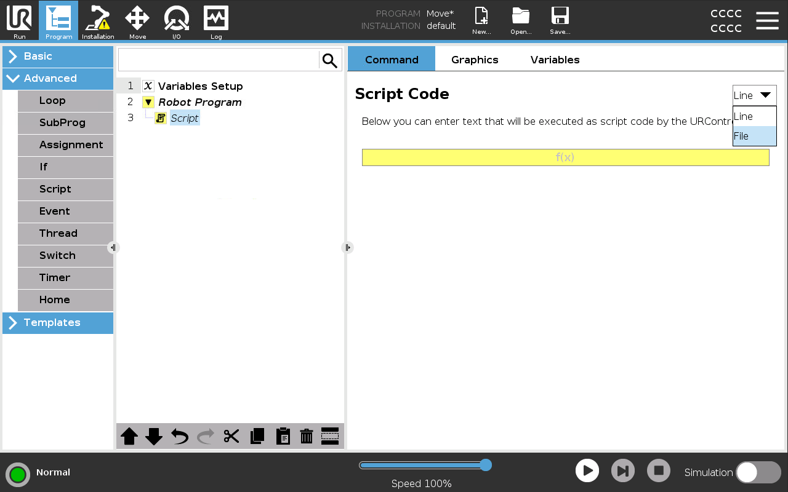
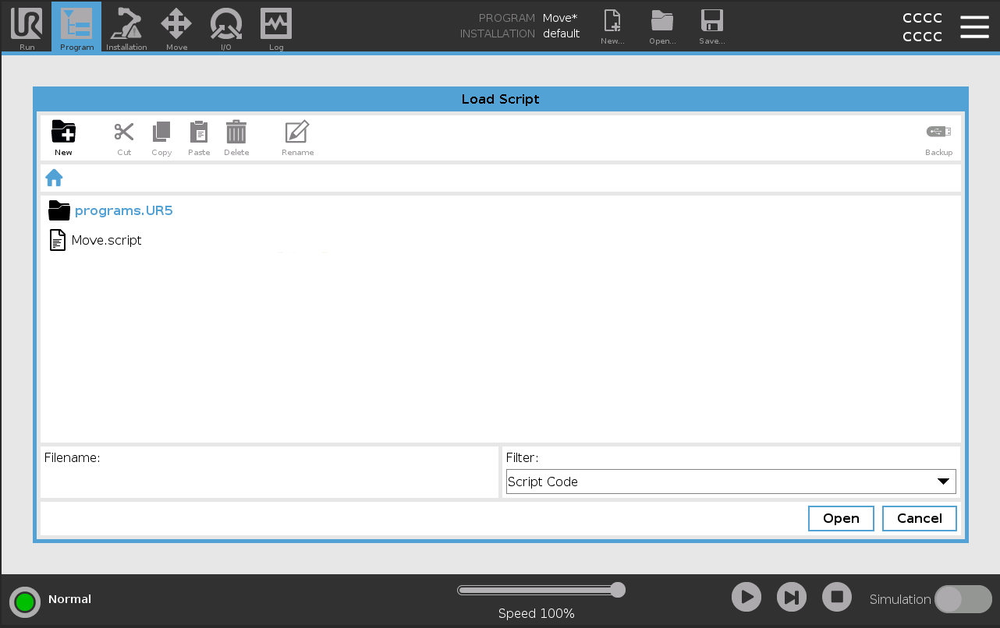
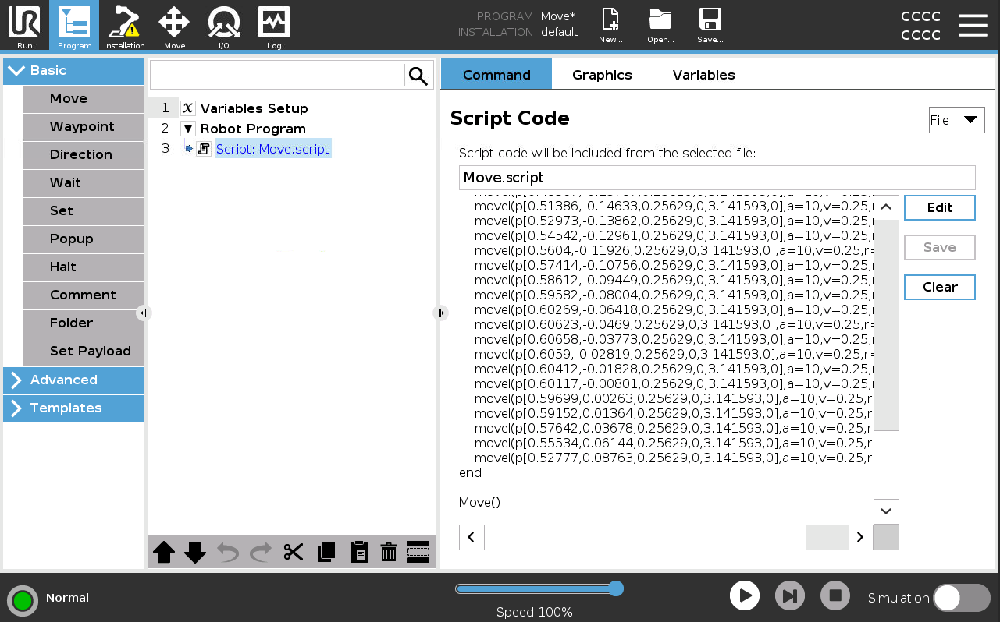

## Universal Robots

[0. Tips](#0-tips)

[1. Controller Options](#1-controller-options)

[2. Uploading Code](#2-uploading-code)

[3. Simulation](#3-simulation)

---
### 0. Tips

1. We do not currently have a means to reference _TCPs_ and _Payloads_ from your current Installation so make sure these are accurately defined in your simulation.
2. You can switch between Process Move (_movep_) and normal (_movel_) for linear motion in the [Controller](../../Overview/Glossary.md#controller) configurator.
3. [Signals](../../Overview/Glossary.md#signal) are identified by their indices so either name your [signals](../../Overview/Glossary.md#signal) with an index, e.g. _2_, or use the [export overrides](../../Grasshopper/6-Control/Contents.md#64-reuse-controller-data) to ensure the correct index is exported.

---
### 1. Controller Options

#### Objective:

In this section we'll explain which **Subsystems** are available in the HAL Robotics Framework for Universal Robots and that their **Capabilities** are. These will be used when you [Configure a Virtual Controller](../../Grasshopper/6-Control/Contents.md#61-configure-a-virtual-controller).

#### Background:

Industrial [Controllers](../../Overview/Glossary.md#controller) are typically comprised of core functionality, such as the ability to run a program, extended through optional extras, like communication protocols or multi-[Robot](../../Overview/Glossary.md#manipulator) support. To ensure that we only try and interact with your real [Controller](../../Overview/Glossary.md#controller) in a way that is compatible, be it through a network or with exported code, we have added a means to configure your [Controller](../../Overview/Glossary.md#controller). The constituent parts of this are:

a.  Controller - this is essentially a computer to which your [Robot](../../Overview/Glossary.md#manipulator) and [Signals](../../Overview/Glossary.md#signal) are connected.

b.  [Capabilities](../../Overview/Glossary.md#capabilities) - these are how we organize what a [Controller](../../Overview/Glossary.md#controller) can do and draw parallels between different manufacturers' [Controllers](../../Overview/Glossary.md#controller). _Capabilities_ are things like the ability to [Upload](../../Overview/Glossary.md#upload) code to the [Controller](../../Overview/Glossary.md#controller) from a PC or the ability to read the values of [Signals](../../Overview/Glossary.md#signal) remotely.

c.  [Subsystems](../../Overview/Glossary.md#subsystems) - these are similar to the options you have in your [Controller](../../Overview/Glossary.md#controller). They are the actual software modules that implement different _Capabilities_.

#### Details:

You'll find two different Universal Robots controllers in our catalogs, _CB3_ (for UR3, UR5 and UR10 robots) and _e-Series CB5_ (for UR3e, UR5e, UR10e, UR16e and UR20 robots). There are minor compatibility differences between them but your interactions with them through the HAL Robotics Framework will be identical.

| Subsystem Name | Description | Capabilities | Configuration |
| -------------- | ----------- | ------------ | ------------- |
| URScript X.X   | Translates [Procedures](../../Overview/Glossary.md#procedure) to URScript. | [Language](../../Overview/Glossary.md#capabilities) | > Enabled - Whether to export the procedure.<br>> Library Mode - Whether to export code that will run directly or that can be called from another function.<br>> Use Process Move - Whether to use Process Move (_movep_) for linear motion. Otherwise normal (_movel_) is used. |
| Dashboard X.X | [Controller](../../Overview/Glossary.md#controller) administration interface. | [Upload](../../Overview/Glossary.md#capabilities)<br>[Execution](../../Overview/Glossary.md#capabilities)<br>[Backup](../../Overview/Glossary.md#capabilities) | > IP - IP address of your remote robot or simulator.<br>> Credentials - Credentials needed to log in to the robot (or [simulator](#3-simulation)) remotely. Defaults will work unless they have been changed in your robot's Settings -> Password -> Admin window. <br>> Root Directory - Directory in which your programs, URCaps etc. are stored. Defaults to '/root' but could be blank if your [simulator is set up as below](#3-simulation) or '/ursim' if using the [default Docker image](#docker). |
| RTDE | Real-Time Data Exchange protocol which allows low latency communication and state streaming from the [controller](../../Overview/Glossary.md#controller). | [Monitor](../../Overview/Glossary.md#capabilities)<br>[Receive State](../../Overview/Glossary.md#capabilities)<br>[Read Signals](../../Overview/Glossary.md#capabilities)<br>[Write Signals](../../Overview/Glossary.md#capabilities) | > IP - IP address of your remote robot or simulator. |
| Remote Files | Copies files to and from a remote [controller](../../Overview/Glossary.md#controller). | [File Manager](../../Overview/Glossary.md#capabilities) | > IP - IP address of your remote robot or simulator.<br>> Credentials - Credentials needed to log in to the robot (or [simulator](#3-simulation)) remotely. Defaults will work unless they have been changed in your robot's Settings -> Password -> Admin window. For a simulator, these should be the user on the host machine. |
| Local Files | Copies files to and from a Docker simulated [controller](../../Overview/Glossary.md#controller). See [Simulation](#3-simulation) below for more details. | [File Manager](../../Overview/Glossary.md#capabilities) | > Root Directory - Path to which the Docker programs path is set. See [Simulation](#3-simulation) below and the [Docker Hub page for the image](https://hub.docker.com/r/universalrobots/ursim_e-series) for more details. |

---
### 2. Uploading Code

#### Objective:

In this section we'll explain how to get the [Procedures](../../Overview/Glossary.md#procedure) you've generated onto your robot. There are two different ways to do this, either (manually)[#manual] or (remotely)[#remote].

#### Remote:

1. Ensure your controller is configured to communicate with your controller. See [Controller Options](#1-controller-options) and [Configure a Virtual Controller](../../Grasshopper/6-Control/Contents.md#61-configure-a-virtual-controller) for more details about what your options are.
2. Follow the instructions in [Upload a Procedure](../../Grasshopper/6-Control/Contents.md#63-upload-a-procedure).
3. That's all!

#### Manual:

1. [Export](../../Grasshopper/6-Control/Contents.md#62-export-a-procedure) your [Procedure](../../Overview/Glossary.md#procedure) to a known directory.
2. Copy the _{ProcedureName}.script_ file onto a USB stick.
3. Insert the USB stick into the USB port on the teach pendant.
4. Create a new **Program** on the controller with a **Script** node (you'll find this under the **Advanced** category) and set the mode to _File_.
[<center></center>](../../assets/images/Manufacturers/URCreateScript.PNG)
<em>Create a Script node into which you can load your URScript file.</em>

5. Click _Edit_ then _Open_ to browse to your _{ProcedureName}.script_ file on the USB stick. You can then _Exit_ the script editor.
[<center></center>](../../assets/images/Manufacturers/URLoadScript.PNG)
<em>Browse the directories and open your URScript file.</em>

6. Your _{ProcedureName}.script_ is now loaded and ready to run.
[<center></center>](../../assets/images/Manufacturers/URManualProgram.PNG)
<em>Browse the directories and open your URScript file.</em>

---
### 3. Simulation

#### Objective:

Whilst we expect most users to use our own [simulation](../../Overview/Glossary.md#73-simulation) tools for the majority of their cases, there may be a reason (e.g. cycle time analysis, or validation of the robot's limits) that you want to run your [Procedures](../../Overview/Glossary.md#procedure) on a manufacturer-provided simulator. This section details what you'll need and how to configure that simulator.

#### Requirements to follow along:

- Linux Mint 17.1 computer or virtual machine, or Docker (in Linux container mode if on a Windows PC).

#### How to:

##### Linux

**For CB Series Robots UR3-UR10** - Download the latest version of URSim **3**.x from [here](https://www.universal-robots.com/download/?filters[]=98759&filters[]=98916&query=). Installation instructions are included on the page.

**For eSeries Robots UR3e-UR16e and UR20** - Download the latest version of URSim **5**.x from [here](https://www.universal-robots.com/download/?filters[]=98759&filters[]=98916&query=). Installation instructions are included on the page.

To enable uploading from the HAL Robotics Framework to URSim you will need to modify the `start-ursim.sh` file in the URSim installation directory. This will need to be done for each installation of URSim you have on the machine.
1. Identify the code block starting with `#program directory`
2. Within this block there should be a line similar to `ln -s $URSIM_ROOT/programs.$ROBOT_TYPE $URSIM_ROOT/programs`
3. Comment this line by prefixing a `#`
4. Add a new line just below containing `ln -s /programs $URSIM_ROOT/programs`

Should end up with something like:
```
...

#program directory
rm -f $URSIM_ROOT/programs
#ln -s $URSIM_ROOT/programs.$ROBOT_TYPE $URSIM_ROOT/programs
ln -s /programs $URSIM_ROOT/programs

...
```

##### Docker

If you prefer to run URSim on a Windows PC or via Docker then there is a Docker image [here](https://hub.docker.com/r/universalrobots/ursim_e-series) although this is (at the time of writing) still listed as experimental. To enable [remote upload](#remote) you will need to ensure that the Dashboard port (_29999_) is exposed in your container. This is mentioned on the [Docker Hub page for the image](https://hub.docker.com/r/universalrobots/ursim_e-series). You will also need to ensure that your [File Manager](../../Overview/Glossary.md#capabilities) is set to Local, its path is set correctly and the _Remote Root Directory_ in your Dashboard matches your Docker bind mounts e.g. _/root_ if you bind mount points to _/root/programs_ or _/ursim_ if following the Docker examples. 

E.g. `docker run --rm -it -p 5900:5900 -p 6080:6080 -p 29999:29999 -v "/c/UniversalRobots/staging/ursim/programs:/ursim/programs" -e ROBOT_MODEL=UR5 universalrobots/ursim_e-series`

In the example below, `-p 29999:29999` is used to enable the Dashboard from your PC and the `-v ...` contains the full path `/ursim/programs` on the left hand side.