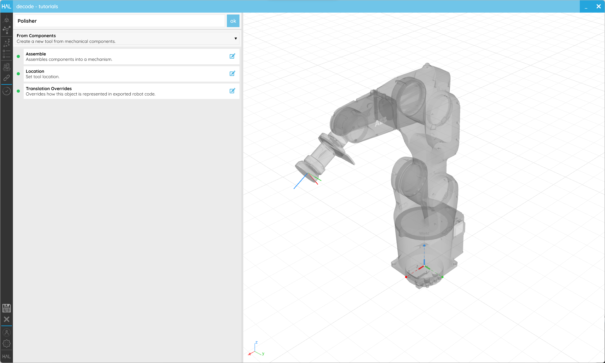
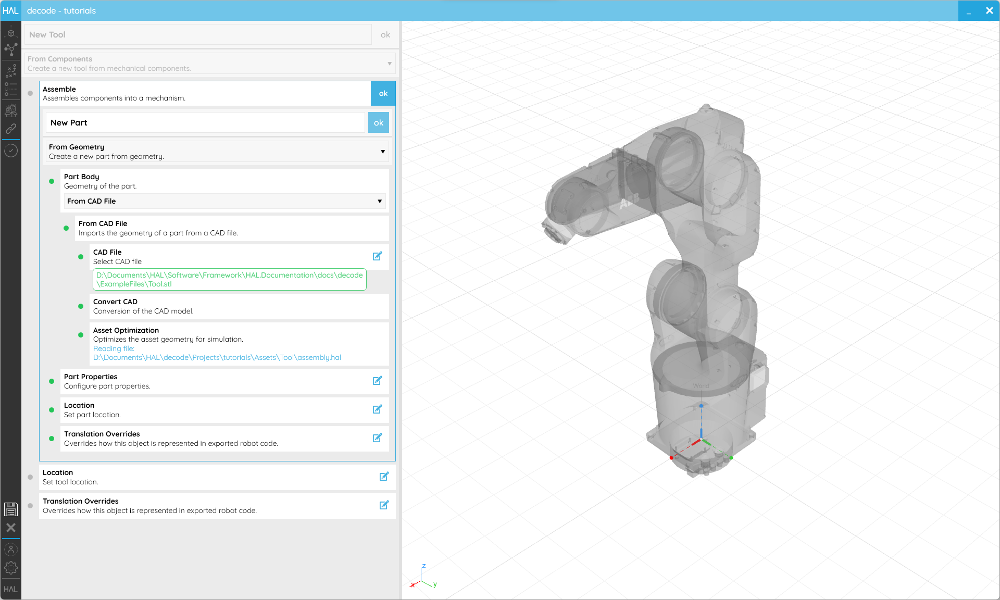
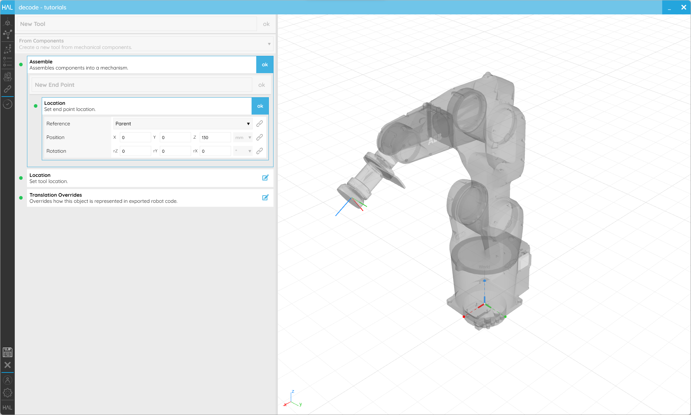
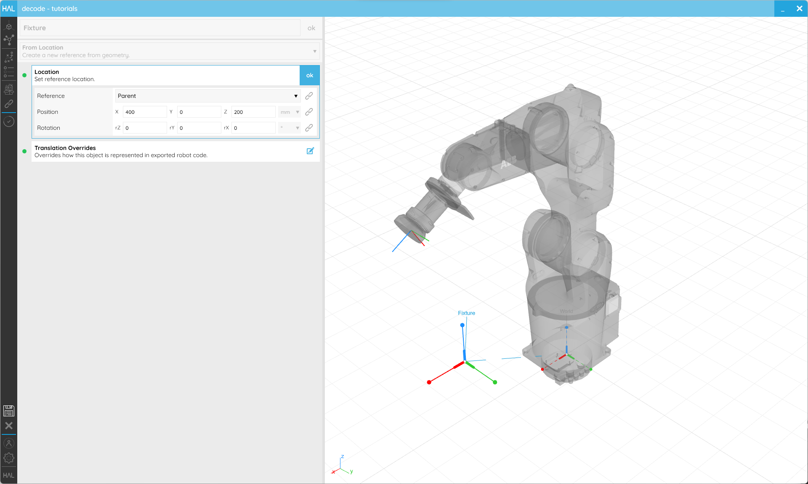
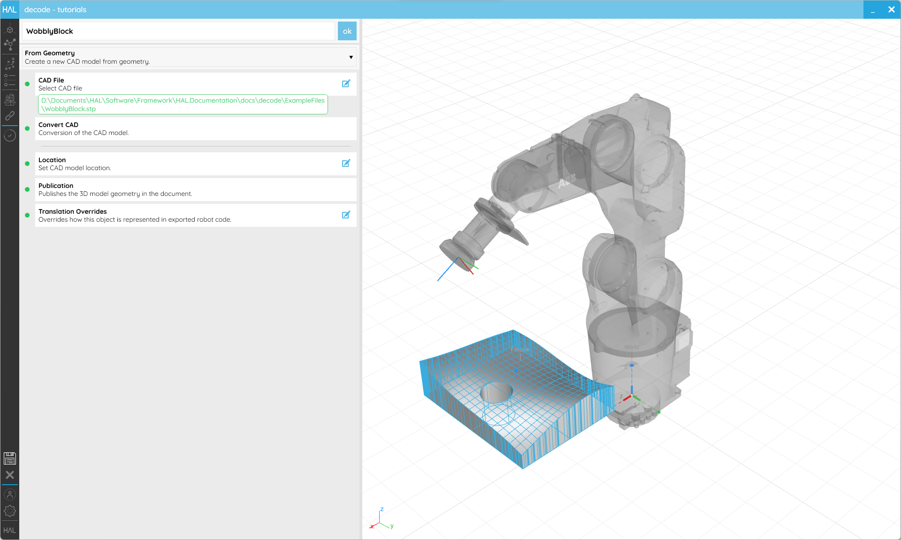
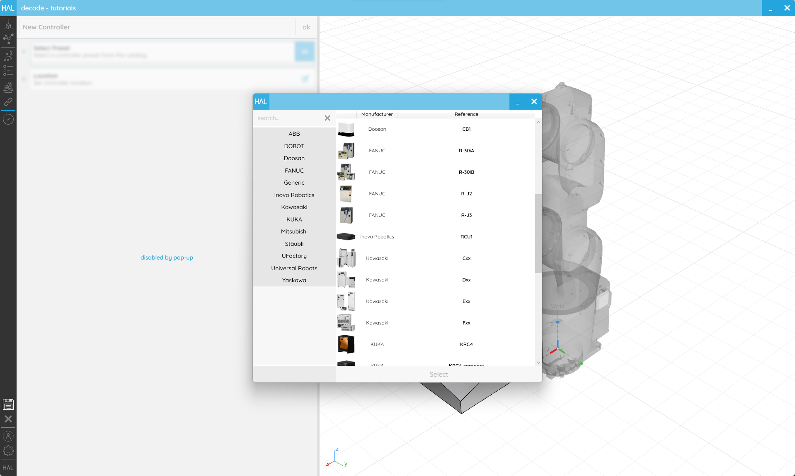
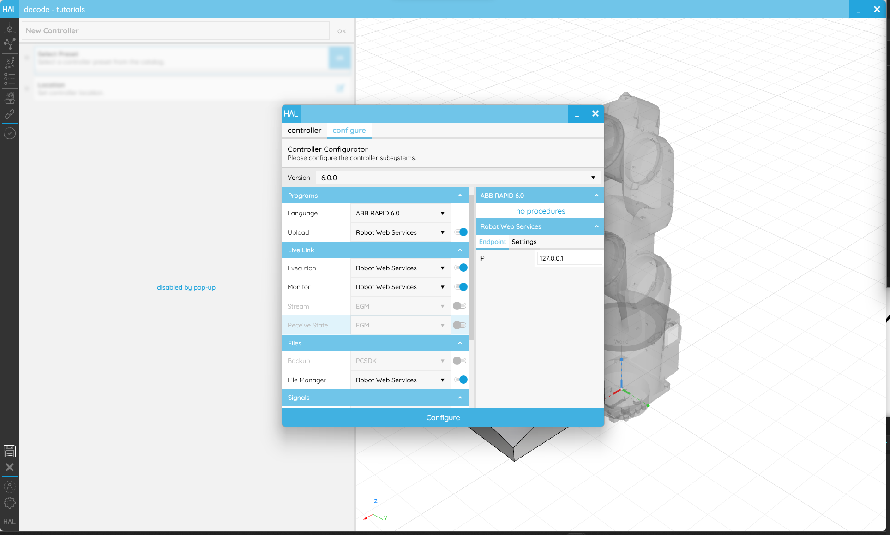
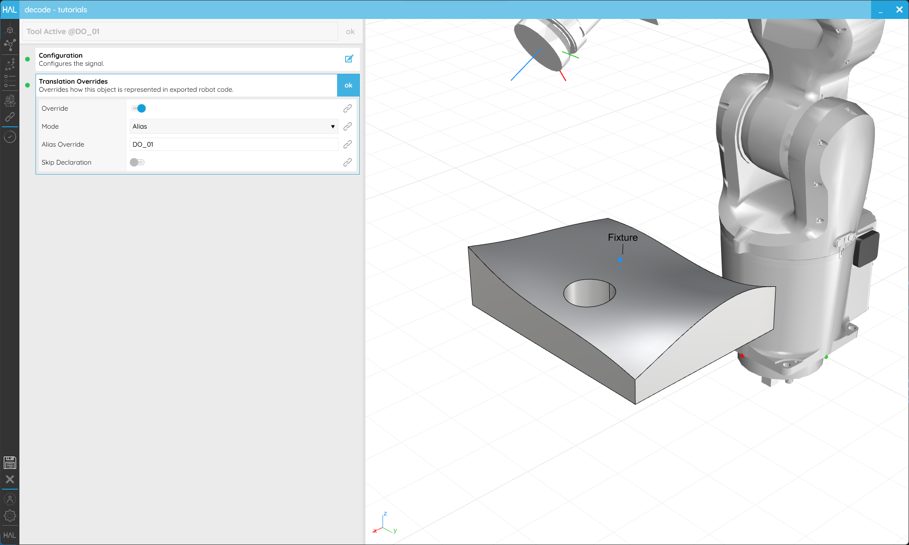

## 2. Cell Setup

[2.1. Insert a Robot](#21-insert-a-robot)

[2.2. Create a Tool](#22-create-a-tool)

[2.3. Create a Reference](#23-create-a-part)

[2.4. Insert a Part](#24-insert-a-part)

[2.5. Create a Controller](#25-create-a-controller)

[2.6. Create a Signal](#26-create-a-signal)

---
### 2.1. Insert a Robot

#### Objective:

In this quick tutorial we'll take a look how to insert a [Robot](../../Overview/Glossary.md#manipulator) preset into your _decode_ scene.

#### Requirements to follow along:

- HAL Robotics _decode_ installed on a PC. See [Installation](../../Overview/0-Administration-and-Setup/Contents.md#01-install) if you need to install the software.
- An open [project](../1-Getting-Started/Contents.md#11-projects)

#### How to:

On the **Scene** screen, select **Robot** from the _Item Type_ selector at the very top, then click **+**. The **From Preset** _Creator_ will allow you to select a [Robot](../../Overview/Glossary.md#manipulator) from our catalogue. 

Select the **Preset** _Step_ and the [Robot](../../Overview/Glossary.md#manipulator) catalogue will pop-up. Double-click on the robot you want to load to choose it. If the [Robot](../../Overview/Glossary.md#manipulator) you want isn't listed, look for the **Scan Online Content** button in lower left-hand corner which will list all the available [Robots](../../Overview/Glossary.md#manipulator) and download whichever one you choose. There are plenty to choose from so it may take a few seconds to list them all. Next time you load the catalogue, your offline [Robots](../../Overview/Glossary.md#manipulator) will be listed.

If you need to set the **Location** of the [Robot](../../Overview/Glossary.md#manipulator), choose that _Step_ and adjust accordingly. The **Reference** setting can be used to adjust whether you want to define a **Location** relative to the **Scene**'s origin, or the element to which the [Robot](../../Overview/Glossary.md#manipulator) is attached, its _Parent_.

Once you are happy with the [Robot](../../Overview/Glossary.md#manipulator)'s setup click **ok** in the upper right corner to return to the **Scene** screen.

<em>There are lots of robots to choose from in the online catalogue.</em>

---
### 2.2. Create a Tool

#### Objective:

In this tutorial we'll create a simple [Tool](../../Overview/Glossary.md#end-effector) for your _decode_ scene.

#### Demo Files:

> [ Tool.stl](../ExampleFiles/Tool.stl)

#### Requirements to follow along:

- HAL Robotics _decode_ installed on a PC. See [Installation](../../Overview/0-Administration-and-Setup/Contents.md#01-install) if you need to install the software.
- An open [project](../1-Getting-Started/Contents.md#11-projects)
- A [Robot](../../Overview/Glossary.md#manipulator) in the **Scene**

#### Background:

More often than not you will need a [Tool](../../Overview/Glossary.md#end-effector) or [End Effector](../../Overview/Glossary.md#end-effector) in your [Cell](../../Overview/Glossary.md#cell) to undertake a process. The [Tool](../../Overview/Glossary.md#end-effector) could be anything from a welding torch to a spindle or even something as simple as a pen. [Tools](../../Overview/Glossary.md#end-effector) can be attached to the end of a manipulator like a [Robot](../../Overview/Glossary.md#manipulator) or stationary with a [Robot](../../Overview/Glossary.md#manipulator) bringing the [Part](../../Overview/Glossary.md#part) to the [Tool](../../Overview/Glossary.md#end-effector).

#### How to:

From the **Scene** screen, select the [Robot](../../Overview/Glossary.md#manipulator) onto which you want to attach the [Tool](../../Overview/Glossary.md#end-effector). That will enable the _Item Type_ selector to list [Tool](../../Overview/Glossary.md#end-effector) as an option. _N.B. Stationary [Tools](../../Overview/Glossary.md#end-effector) will be enabled in a future update._ Click **+** and you'll start creating a [Tool](../../Overview/Glossary.md#end-effector).

The **From Preset** _Creator_ will allow you to select a [Tool](../../Overview/Glossary.md#end-effector) from our catalogue. If one of those works for you, you can skip to settings the **Location** below, but with the enormous variety of [Tools](../../Overview/Glossary.md#end-effector) in the world and even the ease with which one can create an entirely unique, custom [Tool](../../Overview/Glossary.md#end-effector) for a process, chances are good that you will need to model your own [Tool](../../Overview/Glossary.md#end-effector). To do that, select **From Components** in the _Creator_ selector and you'll see the **Assemble** _Step_ appear.

<em>The Tool editor with the From Components Creator selected.</em>

Opening the **Assemble** _Step_ will generate a mini-**Scene** which represents your [Tool](../../Overview/Glossary.md#end-effector). A [Tool](../../Overview/Glossary.md#end-effector) will always be composed of at least one [Part](../../Overview/Glossary.md#part) which acts as its _base_, and one [endpoint](../../Overview/Glossary.md#endpoint) which acts as the [tool centre point (TCP)](../../Overview/Glossary.md#endpoint). 

Start by adding a [Part](../../Overview/Glossary.md#part) and you'll get a whole new _Creator_ embedded. There are lots of options here to explore but the most common workflow is likely to **From Geometry** and importing your _Part Body_ **From CAD File**. There first editable _Step_ therein is _CAD File_ which will allow you to select the CAD file which contains your [Tool](../../Overview/Glossary.md#end-effector)'s geometry. _To keep things simple, it's worth ensuring that the base of that geometry is at the origin of the file you're importing but you can adjust that with the Location if needed._ The next few _Steps_ will work on their own to import that geometric data and convert into our own formats for optimal performance. The rest of the [Part](../../Overview/Glossary.md#part) settings are optional and should be self-explanatory. Click **ok** on the _Creator_ to finish creating that [Part](../../Overview/Glossary.md#part).

<em>The Part Creator in From Geometry mode allowing the importing of a CAD file to act as the Tool's geometry.</em>

Now select your [Part](../../Overview/Glossary.md#part), and you can add an [Endpoint](../../Overview/Glossary.md#endpoint) to it. The only settings here are for the _Location_ of that [Endpoint](../../Overview/Glossary.md#endpoint) which will act as the [TCP](../../Overview/Glossary.md#endpoint). This is most easily set relative to its _Parent_ as a _Reference_ and we recommend that the Z axis of [TCPs](../../Overview/Glossary.md#endpoint) point out of the [Tool](../../Overview/Glossary.md#end-effector), following the co-ordinate system flow of the [Robot](../../Overview/Glossary.md#manipulator) itself. Click **ok** on the _Creator_ to finish creating that [Endpoint](../../Overview/Glossary.md#endpoint) and then on **ok** again to complete the assembly.

 
<em>You will see the position of the TCP in the live preview.</em>

As standard, the [Tool](../../Overview/Glossary.md#end-effector)'s base will be attached to the [Robot](../../Overview/Glossary.md#manipulator)'s _flange_, or [endpoint](../../Overview/Glossary.md#endpoint). Setting the _Location_ allows you to offset that attachment point if you need to.

The **Translation Override** _Step_ will allow you change how the [Tool](../../Overview/Glossary.md#end-effector) is [exported](../../Overview/Glossary.md#export) into [Robot](../../Overview/Glossary.md#manipulator) code.

Once you are happy with the [Tool](../../Overview/Glossary.md#end-effector)'s setup, ensure the name makes it easy to identify and click **ok** in the upper right corner to return to the **Scene** screen.

<em>The Tool should appear attached to our Robot and show the location of our TCP.</em>

---
### 2.3. Create a Reference

#### Objective:

In this tutorial we'll see how to create [References](../../Overview/Glossary.md#reference) for your _decode_ scene.

#### Requirements to follow along:

- HAL Robotics _decode_ installed on a PC. See [Installation](../../Overview/0-Administration-and-Setup/Contents.md#01-install) if you need to install the software.
- An open [project](../1-Getting-Started/Contents.md#11-projects)

#### Background:

[References](../../Overview/Glossary.md#reference) are useful because they allow us to specify [Targets](../../Overview/Glossary.md#target) relative to something other than the world or the base of the [Robot](../../Overview/Glossary.md#manipulator). This means that they can be recalibrated in the real world without the need to regenerate a [Toolpath](../../Overview/Glossary.md#toolpath) or [Procedure](../../Overview/Glossary.md#procedure). They can also be connected one onto another to create a logical hierarchy of elements that can be moved as one.

#### How to:

From the **Scene** screen, select the [Reference](../../Overview/Glossary.md#reference) onto which you want to attach your new [Reference](../../Overview/Glossary.md#reference), or click anywhere in the white space to clear your current selection. You can always drag and drop [References](../../Overview/Glossary.md#reference) onto each other to restructure your **Scene** later. Either of those states will enable the _Item Type_ selector to list [Reference](../../Overview/Glossary.md#reference) as an option. Click **+** and you'll start creating a [Reference](../../Overview/Glossary.md#reference). 

The **From Location** _Creator_ will allow you to set its [Location](../1-Getting-Started/Contents.md#locations) and [Translation Overrides](../1-Getting-Started/Contents.md#translation-overrides), both of which should be familiar to you by now. If not, please refer back to the tutorials above for more details.

Once you are happy with the [Reference](../../Overview/Glossary.md#reference)'s setup, ensure the name makes it easy to identify and click **ok** in the upper right corner to return to the **Scene** screen.

<em>References can be used to relocate or calibrate Parts and CAD Models, or structure your Scene.</em>

#### Next:

Take a look at the next tutorial on creating [Parts](../../Overview/Glossary.md#part) to learn how to add geometry to your [References](../../Overview/Glossary.md#reference).

---
### 2.4. Create a Part

#### Objective:

In this tutorial we'll see how to add [Parts](../../Overview/Glossary.md#part) to your _decode_ scene.

#### Demo Files:

> [  WobblyBlock.stp](../ExampleFiles/WobblyBlock.stp)

#### Requirements to follow along:

- HAL Robotics _decode_ installed on a PC. See [Installation](../../Overview/0-Administration-and-Setup/Contents.md#01-install) if you need to install the software.
- An open [project](../1-Getting-Started/Contents.md#11-projects)
- Reading the [Create a Reference](#23-create-a-reference) tutorial is highly recommended.

#### Background:

[Parts](../../Overview/Glossary.md#part) serve two roles in _decode_ and come in two variants. Firstly, [Parts](../../Overview/Glossary.md#part) can be used to populate your [Cells](../../Overview/Glossary.md#cell) with environmental elements such as pedestals, tables or tool holders which can in turn be used as [References](../../Overview/Glossary.md#reference) for your [Toolpaths](../../Overview/Glossary.md#toolpath). They can also be used as the basis geometry for [Toolpaths](../../Overview/Glossary.md#toolpath), e.g. following edges or surfaces. When we import [Parts](../../Overview/Glossary.md#part) for the environment, we optimise them for performance. To retain all the geometric data and therefore enable the latter use, use a **CAD Model** instead. Both are grouped here because the settings and workflow are almost identical and we'll use [Parts](../../Overview/Glossary.md#part) as a general term for both below.

#### How to:

From the **Scene** screen, select the [Reference](../../Overview/Glossary.md#reference) onto which you want to attach your new [Part](../../Overview/Glossary.md#part), or click anywhere in the white space to clear your current selection. You can always drag and drop [Parts](../../Overview/Glossary.md#part) onto each other to restructure your **Scene** later. Either of those states will enable the _Item Type_ selector to list [Part](../../Overview/Glossary.md#part) and **CAD Model** as options. So we can reuse it in later tutorials, let's opt for the **CAD Model** now and use our [Wobbly Block](../ExampleFiles/WobblyBlock.stp) example file. Click **+** and you'll enter the editor.

The **From Geometry** _Creator_ will allow you to select a **CAD File**, [Location](../1-Getting-Started/Contents.md#locations) and [Translation Overrides](../1-Getting-Started/Contents.md#translation-overrides), all of which should be familiar to you by now. If not, please refer back to the tutorials above for more details.

Once you are happy with the [Part](../../Overview/Glossary.md#part) or **CAD Model**'s setup, ensure the name makes it easy to identify and click **ok** in the upper right corner to return to the **Scene** screen.

<em>Parts can be used as environmental context whilst CAD Models are useful to extract geometric data for Toolpaths later.</em>

---
### 2.5. Create a Controller

#### Objective:

In this tutorial we'll look at how you can create and configure a virtual [Controller](../../Overview/Glossary.md#controller) to match your real [Controller](../../Overview/Glossary.md#controller) in your _decode_ scene.

#### Requirements to follow along:

- HAL Robotics _decode_ installed on a PC. See [Installation](../../Overview/0-Administration-and-Setup/Contents.md#01-install) if you need to install the software.
- An open [project](../1-Getting-Started/Contents.md#11-projects)
- A [Robot](../../Overview/Glossary.md#manipulator) in the **Scene** is recommended

#### Background:

Industrial [Controllers](../../Overview/Glossary.md#controller) are typically comprised of core functionality, such as the ability to run a program, extended through optional extras, like communication protocols or multi-[Robot](../../Overview/Glossary.md#manipulator) support. To ensure that we only try and interact with your real [Controller](../../Overview/Glossary.md#controller) in a way that is compatible, be it through a network or with exported code, we have added a means to configure your [Controller](../../Overview/Glossary.md#controller). The constituent parts of this are:

a.  [Controller](../../Overview/Glossary.md#controller) - this is essentially a computer to which your [Robot](../../Overview/Glossary.md#manipulator) and [Signals](../../Overview/Glossary.md#signal) are connected.

b.  Capabilities - these are how we organize what a [Controller](../../Overview/Glossary.md#controller) can do and draw parallels between different manufacturers' [Controllers](../../Overview/Glossary.md#controller). _Capabilities_ are things like the ability to [Upload](../../Overview/Glossary.md#upload) code to the [Controller](../../Overview/Glossary.md#controller) from a PC or the ability to read the values of [Signals](../../Overview/Glossary.md#signal) remotely.

c.  Subsystems - these are similar to the options you have in your [Controller](../../Overview/Glossary.md#controller). They are the actual software modules that implement different _Capabilities_.

#### How to:

All of these different parts are best explored with concrete examples so let's create a [Controller](../../Overview/Glossary.md#controller) and look at how we can configure it.
From the **Scene** screen, select the [Reference](../../Overview/Glossary.md#reference) onto which you want to attach your new [Controller](../../Overview/Glossary.md#controller), or click anywhere in the white space to clear your current selection. Either of those states will enable the _Item Type_ selector to list [Controller](../../Overview/Glossary.md#controller) as an option. Click **+** and you'll enter the editor.

There is only one _Creator_ available here. Select the **Preset** _Step_ and the [Controller](../../Overview/Glossary.md#controller) catalogue will pop-up. Double-click on the [Controller](../../Overview/Glossary.md#controller) you want to load to choose it. If the [Controller](../../Overview/Glossary.md#controller) you want isn't listed, look for the **Scan Online Content** button in lower left-hand corner which will list all the available [Controllers](../../Overview/Glossary.md#controller) and download whichever one you choose. Next time you load the catalogue, your offline [Controllers](../../Overview/Glossary.md#controller) will be listed.

 
<em>There are Controllers from all our supported manufacturers in the Controller catalogue.</em>

For this example, we're going to use the `IRC5 Compact V2` but you will find details for any other manufacturer's [Controllers](../../Overview/Glossary.md#controller) in the [manufacturer-specific documentation](../../Manufacturers/Contents.md). When we select a [Controller](../../Overview/Glossary.md#controller), if there is anything to configure, a configuration page will pop-up.

The first thing we'll see at the top is the system version. In the case of ABB this is the RobotWare version but for KUKA this would be KUKA System Software or in Universal Robots it will be the Polyscope version. It's important to note that these are version ranges so don't expect to see every point release listed. By changing the version we'll change which **Subsystems** are available. If we switch down to `5.14`, `EGM` will disappear from the options below because it was only introduced in Robotware 6.

The rest of the window is split in two; on the left is **Subsystem** and **Capability** selection and on the right is parametrization. In the left-hand column we can see the **Capabilities** listed with **Subsystems** that implement that **Capability** in a drop-down alongside. Let's look specifically at `Upload`. By hovering over the name, we can see that the `Upload` **Capability** enables [Procedure](../../Overview/Glossary.md#procedure) [Uploading](../../Overview/Glossary.md#upload) to a remote [Controller](../../Overview/Glossary.md#controller). We can also see that there are two subsystems that offer this **Capability**, `PCSDK` and `Robot Web Services (RWS)`. `RWS` is built in to the latest Robotware versions but to use the `PCSDK` we need the option "PC Interface" on our [Controller](../../Overview/Glossary.md#controller). If you don't have that option you can change **Subsystem** to ensure we use a compatible method to [Upload](../../Overview/Glossary.md#upload) [Procedures](../../Overview/Glossary.md#procedure) to your [Controller](../../Overview/Glossary.md#controller). There may also be circumstances where we don't have any of the options installed or don't want access to a **Capability** for security purposes. In that case we can deactivate the **Capability** using its toggle. On the right-hand side of the window, we have the inputs to configure our **Subsystems**. Only active **Subsystems** are listed so if we deactivate both `EGM` **Capabilities** the `EGM` parameters will disappear. Once we have changed the relevant properties we can select "Configure" to apply our changes. Closing the window without configuring will leave the [Controller](../../Overview/Glossary.md#controller) in an invalid, unconfigured state.

 
<em>The controller configurator allows you to match the capabilities of your real Controller in the virtual Scene.</em>

If you need to set the _Location_ of the [Controller](../../Overview/Glossary.md#controller), choose that _Step_ and adjust accordingly. The _Reference_ setting can be used to adjust whether you want to define a _Location_ relative to the **Scene**'s origin, or the element to which the [Controller](../../Overview/Glossary.md#controller) is attached, its _Parent_.

Once you are happy with the [Controller](../../Overview/Glossary.md#controller)'s setup click **ok** in the upper right corner to return to the **Scene** screen. [Controllers](../../Overview/Glossary.md#controller) are hidden by default in the **Scene** but can be shown using the _eye_ icon.

---
### 2.6. Create a Signal

#### Objective:

In this tutorial we'll create a [Signal](../../Overview/Glossary.md#signal) that can be programmed in _decode_.

#### Requirements to follow along:

- HAL Robotics _decode_ installed on a PC. See [Installation](../../Overview/0-Administration-and-Setup/Contents.md#01-install) if you need to install the software.
- An open [project](../1-Getting-Started/Contents.md#11-projects)
- A [Robot](../../Overview/Glossary.md#manipulator) in the **Scene**
- A [Controller](../../Overview/Glossary.md#controller) in the **Scene**

#### Background:

Electrical Input and Output (I/O) [Signals](../../Overview/Glossary.md#signal) are used to activate or deactivate [Tools](../../Overview/Glossary.md#end-effector), trigger actions on remote machines or pass data between **Sensors**.

#### How to:

From the **Network** screen, select the **I/O Signals Board** into which you want to add your new [Signal(s)](../../Overview/Glossary.md#signal). [Signals](../../Overview/Glossary.md#signal) can't be moved between **Boards** later. That will enable the _Item Type_ selector to list a number of different [Signals](../../Overview/Glossary.md#signal) types. Select whichever you need but **Digital Output**s are very common so we'll use that as our example here. Click **+** and you'll start creating a [Signal](../../Overview/Glossary.md#signal) of your selected type.

The **Configuration** _Step_ will allow you to set its upper and lower limits (leave `0` to `24V` if you are unsure). The[Translation Overrides](../1-Getting-Started/Contents.md#translation-overrides) will allow you to use a human readable name within _decode_ but change what's [exported](../../Overview/Glossary.md#export).

Once you are happy with the [Signal](../../Overview/Glossary.md#signal)'s setup, ensure the name makes it easy to identify and click **ok** in the upper right corner to return to the **Network** screen.

<em>Translation overrides make it easy to identify Signals without breaking the exported code.</em>

---

[Continue to: 3. Programming](../3-Programming/Contents.md#3-programming)