## 3. Programming

[3.0. Procedures](#30-procedures)

[3.1. Move](#31-move)

[3.2. Wait for a Time](#32-wait-for-a-time)

[3.3. Set a Signal](#33-set-a-signal)

[3.4. Paths](#34-paths)

[3.5. Custom Actions](#35-custom-actions)

[3.6. Structuring Procedures](#36-structuring-procedures)

[3.7. Validation and Simulation](#37-validation-and-simulation)

---
### 3.0. Procedures

#### Objective:

In this tutorial we'll cover the main structure and background of [Procedures](../../Overview/Glossary.md#procedure) in _decode_.

#### Background:

[Procedures](../../Overview/Glossary.md#procedure) are a sequence of [Actions](../../Overview/Glossary.md#action) to be executed by a [Controller](../../Overview/Glossary.md#controller). In the **Programming** screen you'll find tools to create individual, atomic [Actions](../../Overview/Glossary.md#action) like [Move](../../Overview/Glossary.md#motion-action) or [Wait](../../Overview/Glossary.md#wait-action) as well as ones which generate complex [Toolpaths](../../Overview/Glossary.md#toolpath) comprised of 10s, 100s or even 1000s of individual [Actions](../../Overview/Glossary.md#action).

Each [Robot](../../Overview/Glossary.md#manipulator) has a main [Procedure](../../Overview/Glossary.md#procedure), always the first in the list, assigned to it. You can add [Procedures](../../Overview/Glossary.md#procedure) to a [Robot](../../Overview/Glossary.md#manipulator) to help you [structure your code](#36-structuring-procedures), but it's only the main one which will be [Solved](../../Overview/Glossary.md#solving), [Simulated](../../Overview/Glossary.md#73-simulation) or [Exported](../../Overview/Glossary.md#74-control). [Procedures](../../Overview/Glossary.md#procedure) can be added via the **+** button in the upper right-hand corner of the **Programming** screen and renamed,or removed through the menu button next to it.

[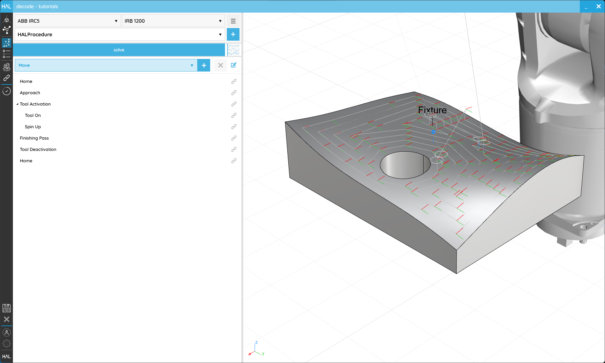](../../assets/images/decode/03-Programming/Programming-Complete-01.png) 
<em>Even complex Toolpaths can be kept to simple Procedures in _decode_.</em>

---
### 3.1. Move

#### Objective:

In this tutorial we'll look at the different ways that we can program individual [Motions](../../Overview/Glossary.md#motion-action) in _decode_.

#### Requirements to follow along:

- HAL Robotics _decode_ installed on a PC. See [Installation](../../Overview/0-Administration-and-Setup/Contents.md#01-install) if you need to install the software.
- An open [project](../1-Getting-Started/Contents.md#11-projects)
- A [Robot](../../Overview/Glossary.md#manipulator) in the **Scene**
- A [Controller](../../Overview/Glossary.md#controller) in the **Scene**

#### Background:

Motions are the fundamental building block of [Robot](../../Overview/Glossary.md#manipulator) programming instructing the [Robot](../../Overview/Glossary.md#manipulator) to go from its current position to somewhere else. We define where a [Robot](../../Overview/Glossary.md#manipulator) should move using [Targets](../../Overview/Glossary.md#target) and how they should get there with [Motion](../../Overview/Glossary.md#motion-action) Settings.
We can mix and match [Target](../../Overview/Glossary.md#target) creation techniques with different [Motion Spaces](../../Overview/Glossary.md#joint-space) ass we'll see below.

#### How to:

From the **Programming** screen, select the [Group](#36-structuring-procedures) into which you want to add your new [Move](../../Overview/Glossary.md#motion-action), or click anywhere in the white space to clear your current selection. You can always drag and drop [Actions](../../Overview/Glossary.md#action) onto [Groups](#36-structuring-procedures) or in between other [Actions](../../Overview/Glossary.md#action) to restructure your [Procedure](../../Overview/Glossary.md#procedure) later. Either of those states will enable the _Item Type_ selector to list [Move](../../Overview/Glossary.md#motion-action) as an option. Click **+** and you'll start creating a [Move](../../Overview/Glossary.md#motion-action).

There are two _Steps_ here which align with the _where_ and _how_ the [Robot](../../Overview/Glossary.md#manipulator) moves mentioned above.

There are 2 main ways of creating [Targets](../../Overview/Glossary.md#target), both of which are found in the **Target** _Step_.

[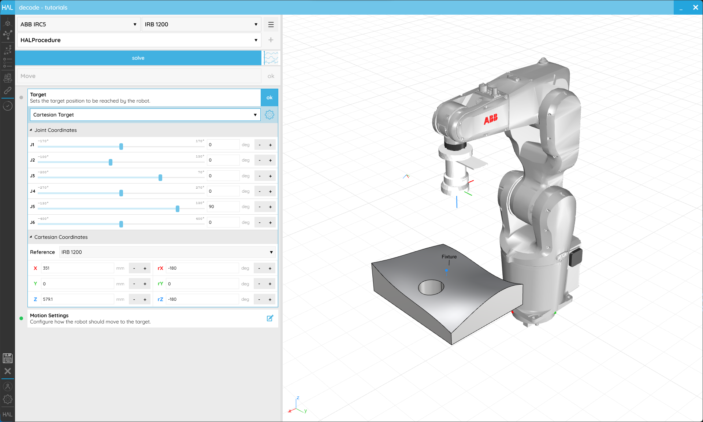](../../assets/images/decode/03-Programming/Programming-Move-Target.png) 
<em>Targets in _decode_ can be edited in Joint or Cartesian spaces.</em>

The first way of creating a [Target](../../Overview/Glossary.md#target) is in [Joint space](../../Overview/Glossary.md#joint-space), that is by defining the desired position of each active [Joint](../../Overview/Glossary.md#joint) of your [Robot](../../Overview/Glossary.md#manipulator). The list of _Positions_ correspond to each active [Robot](../../Overview/Glossary.md#manipulator) [Joint](../../Overview/Glossary.md#joint). As you change these values, you can visualize the final position of our [Robot](../../Overview/Glossary.md#manipulator) at these [Joint](../../Overview/Glossary.md#joint) positions.

The other way of creating a [Target](../../Overview/Glossary.md#target) is a [Cartesian](../../Overview/Glossary.md#cartesian-space) [Target](../../Overview/Glossary.md#target) from a **Frame**. When a [Robot](../../Overview/Glossary.md#manipulator) moves to a [Cartesian](../../Overview/Glossary.md#cartesian-space) [Target](../../Overview/Glossary.md#target) the active [TCP](../../Overview/Glossary.md#endpoint) of our [Robot](../../Overview/Glossary.md#manipulator) will align with the [Target's](../../Overview/Glossary.md#target) position and orientation. As you change the values of that **Frame** you can see our [Target](../../Overview/Glossary.md#target) move and our [Robot](../../Overview/Glossary.md#manipulator) moves with it. A **Frame** is always relative to a [Reference](../../Overview/Glossary.md#reference) which can also be set here. Please take a look at the [References tutorial](../2-Cell/Contents.md#23-create-a-reference) to see how those work.

At the top of the **Target** _Step_ is a crucial selector. It allows us to specify the [Motion Space](../../Overview/Glossary.md#joint-space) in which we want to store the [Target](../../Overview/Glossary.md#target). _N.B. This does not affect **how** we move to the [Target](../../Overview/Glossary.md#target)._ 
Selecting [Joint Space](../../Overview/Glossary.md#joint-space) will mean that we consider only those [Joint](../../Overview/Glossary.md#joint) positions and we ignore the [Cartesian](../../Overview/Glossary.md#cartesian-space) **Frame**. If, for example, you were to change the length of your [Tool](../../Overview/Glossary.md#end-effector) or the location of a [Reference](../../Overview/Glossary.md#reference), it wouldn't matter because these are fixed values for each [Joint](../../Overview/Glossary.md#joint).
Selecting [Cartesian Space](../../Overview/Glossary.md#cartesian-space) will mean that we only consider the [Cartesian](../../Overview/Glossary.md#cartesian-space) **Frame**. If, for example, you were to change the length of your [Tool](../../Overview/Glossary.md#end-effector) or the location of a [Reference](../../Overview/Glossary.md#reference), we will recompute the values for each [Joint](../../Overview/Glossary.md#joint) to get the [Robot](../../Overview/Glossary.md#manipulator) into that position.

Either of these [Target](../../Overview/Glossary.md#target) creation options give exactly the same types of [Target](../../Overview/Glossary.md#target) so can be used with any **Motion Settings**.

[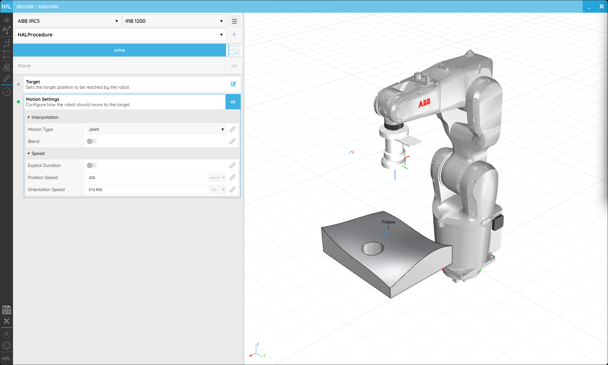](../../assets/images/decode/03-Programming/Programming-Move-MotionSettings.png) 
<em>Motion Settings tell the Robot how to get to the Target.</em>

_Motion Type_ controls which path the [Robot](../../Overview/Glossary.md#manipulator) takes to a [Target](../../Overview/Glossary.md#target). In `Cartesian` mode the [TCP](../../Overview/Glossary.md#endpoint) moves in a very controlled manner along a straight line or arc. This is probably the easier motion type to visualize but can cause problems when moving between configurations or when trying to optimise cycle times. Moving in [Joint space](../../Overview/Glossary.md#joint-space) means that each [Joint](../../Overview/Glossary.md#joint) will move from one position to the next without consideration for the position of the [TCP](../../Overview/Glossary.md#endpoint). [Joint space](../../Overview/Glossary.md#joint-space) [Moves](../../Overview/Glossary.md#motion-action) always end in the same configuration and are not liable to [Singularities](../../Overview/Glossary.md#(kinematic)-singularity). It's often useful to start your [Procedures](../../Overview/Glossary.md#procedure) with a [Motion](../../Overview/Glossary.md#motion-action) in [Joint space](../../Overview/Glossary.md#joint-space) to ensure your [Robot](../../Overview/Glossary.md#manipulator) is always initialized to a known position and configuration. It's worth noting that when using [Joint space](../../Overview/Glossary.md#joint-space) [Motions](../../Overview/Glossary.md#motion-action) your [Toolpath](../../Overview/Glossary.md#toolpath) preview will be dotted until the [Procedure](../../Overview/Glossary.md#procedure) is [Solved](../../Overview/Glossary.md#solving) because we can't know ahead of time exactly where the [TCP](../../Overview/Glossary.md#endpoint) will go during that [Motion](../../Overview/Glossary.md#motion-action). Once [Solved](../../Overview/Glossary.md#solving), you will see the path your [TCP](../../Overview/Glossary.md#endpoint) will actually take in space.

_[Blends](../../Overview/Glossary.md#blend)_ sometimes called zones or approximations change how close the [Robot](../../Overview/Glossary.md#manipulator) needs to get to a [Target](../../Overview/Glossary.md#target) before moving on to the next. It's useful to consider your _[Blends](../../Overview/Glossary.md#blend)_ carefully because increasing their size can drastically improve cycle time by allowing the [Robot](../../Overview/Glossary.md#manipulator) to maintain speed instead of coming to a stop at each [Target](../../Overview/Glossary.md#target). _[Blends](../../Overview/Glossary.md#blend)_ are most easily visualized in _Position_. If we set a 100 mm radius [Blend](../../Overview/Glossary.md#blend), we can see a circle appear around our [Target](../../Overview/Glossary.md#target) (unless it's the very first in a Procedure). This indicates that the [Robot](../../Overview/Glossary.md#manipulator) will exactly follow our [Toolpath](../../Overview/Glossary.md#toolpath) until it gets within 100 mm of the [Target](../../Overview/Glossary.md#target), at which point it will start to deviate within that circle to keep its speed up and head towards the subsequent [Target](../../Overview/Glossary.md#target). It will exactly follow our [Toolpath](../../Overview/Glossary.md#toolpath) again when it leaves the circle. When we solve our [Procedure](../../Overview/Glossary.md#procedure), we can see the path our [TCP](../../Overview/Glossary.md#endpoint) will actually take getting close but not actually to all of our [Targets](../../Overview/Glossary.md#target).

_Speed_ settings, as the name implies, constrain the speed of your [Robot](../../Overview/Glossary.md#manipulator). They can be declared in [Cartesian space](../../Overview/Glossary.md#cartesian-space) to directly limit the position or orientation _Speed_ of the [TCP](../../Overview/Glossary.md#endpoint). You can also constrain the _Speeds_ of your [Robot's](../../Overview/Glossary.md#manipulator) [Joints](../../Overview/Glossary.md#joint) using the second overload or combine the two using the third overload. Please note that not all [Robot](../../Overview/Glossary.md#manipulator) manufacturers support programmable [Joint](../../Overview/Glossary.md#endpoint) speed constraints so there may be variations between your simulation and real [Robot](../../Overview/Glossary.md#manipulator) when they are used.

_Acceleration_ settings constrain the acceleration of your [Robot](../../Overview/Glossary.md#manipulator). They function in exactly the same way as the _Speeds_, constraining [Cartesian](../../Overview/Glossary.md#cartesian-space) acceleration, [Joint](../../Overview/Glossary.md#joint-space) acceleration or both.

[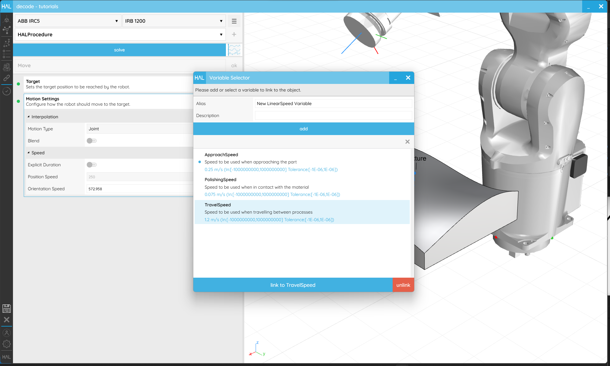](../../assets/images/decode/03-Programming/Programming-Move-MotionSettings-Variable.png) 
<em>Linking Motion Settings to Variables helps speed up any changes you might need to make in the future and are necessary if you want an operator to be able to change a value.</em>

Once you are happy with the [Move](../../Overview/Glossary.md#motion-action)'s setup, ensure the name makes it easy to identify and click **ok** in the upper right corner to return to the **Programming** screen.

---
### 3.2. Wait for a Time

#### Objective:

In this tutorial we'll create a [Wait Action](../../Overview/Glossary.md#wait-action) that pauses [Robot](../../Overview/Glossary.md#manipulator) execution for a fixed period of time using the HAL Robotics Framework for Grasshopper.

#### Requirements to follow along:

- HAL Robotics _decode_ installed on a PC. See [Installation](../../Overview/0-Administration-and-Setup/Contents.md#01-install) if you need to install the software.
- An open [project](../1-Getting-Started/Contents.md#11-projects)
- A [Robot](../../Overview/Glossary.md#manipulator) in the **Scene**
- A [Controller](../../Overview/Glossary.md#controller) in the **Scene**

#### Background:

In certain scenarios it may be necessary to have your [Robot](../../Overview/Glossary.md#manipulator) [Wait](../../Overview/Glossary.md#wait-action) in its current position. This could be because it's taking a measurement, a [Tool](../../Overview/Glossary.md#end-effector) is working or simply because something else is happening in the environment. If the time to [Wait](../../Overview/Glossary.md#wait-action) is a constant, such as the time required for a gripper to open, then a **Wait Time** [Action](../../Overview/Glossary.md#action) is a good solution.

#### How to:

From the **Programming** screen, select the [Group](#36-structuring-procedures) into which you want to add your new [Wait](../../Overview/Glossary.md#wait-action), or click anywhere in the white space to clear your current selection. You can always drag and drop [Actions](../../Overview/Glossary.md#action) onto [Groups](#36-structuring-procedures) or in between other [Actions](../../Overview/Glossary.md#action) to restructure your [Procedure](../../Overview/Glossary.md#procedure) later. Either of those states will enable the _Item Type_ selector to list [Wait](../../Overview/Glossary.md#wait-action) as an option. Click **+** and you'll start creating a [Wait Action](../../Overview/Glossary.md#wait-action).

[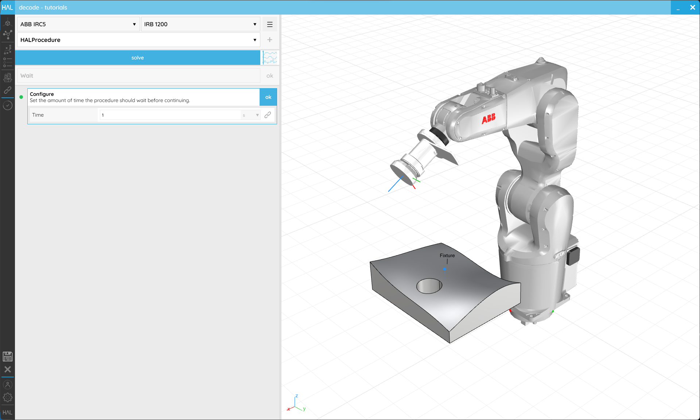](../../assets/images/decode/03-Programming/Programming-WaitTime-Complete.png) 
<em>Waits allow the Robot to hold in position for a given time.</em>

The default, **From Time** _Creator_ will allow you to set the time for which the robot should pause. For example, if the _Time_ is set to 2 seconds, when we [Simulate](#37-validation-and-simulation) the [Robot](../../Overview/Glossary.md#manipulator) pauses for 2 seconds.

Once you are happy with the [Wait](../../Overview/Glossary.md#wait-action)'s setup, ensure the name makes it easy to identify and click **ok** in the upper right corner to return to the **Programming** screen.

---
### 3.3. Set a Signal

#### Objective:

In this tutorial we'll change the state of a [Signal](../../Overview/Glossary.md#signal) at runtime in _decode_.

#### Requirements to follow along:

- HAL Robotics _decode_ installed on a PC. See [Installation](../../Overview/0-Administration-and-Setup/Contents.md#01-install) if you need to install the software.
- An open [project](../1-Getting-Started/Contents.md#11-projects)
- A [Robot](../../Overview/Glossary.md#manipulator) in the **Scene**
- A [Controller](../../Overview/Glossary.md#controller) in the **Scene**
- A [Signal](../../Overview/Glossary.md#signal) in your **Network**. If you don't have one, see the [Create a Signal](../2-Cell/Contents.md#26-create-a-signal) tutorial for more information.

#### Background:

Electrical Input and Output (I/O) [Signals](../../Overview/Glossary.md#signal) are used to activate or deactivate [Tools](../../Overview/Glossary.md#end-effector), trigger actions on remote machines or pass data between **Sensors**. The activation of these [Signals](../../Overview/Glossary.md#signal) needs to be triggered at the right time during program execution, something we can do easily with [Signal Actions](../../Overview/Glossary.md#signal-action).

#### How to:

In our previous tutorial, we created a digital output [Signal](../../Overview/Glossary.md#signal) within a [Controller](../../Overview/Glossary.md#controller) and assigned it an appropriate _Name_.. We now want to change the state of that [Signal](../../Overview/Glossary.md#signal) during the execution of a [Procedure](../../Overview/Glossary.md#procedure). To do so, from the **Programming** screen, select the [Group](#36-structuring-procedures) into which you want to add your new [Signal Action](../../Overview/Glossary.md#signal-action), or click anywhere in the white space to clear your current selection. You can always drag and drop [Actions](../../Overview/Glossary.md#action) onto [Groups](#36-structuring-procedures) or in between other [Actions](../../Overview/Glossary.md#action) to restructure your [Procedure](../../Overview/Glossary.md#procedure) later. Either of those states will enable the _Item Type_ selector to list [Set Signal](../../Overview/Glossary.md#signal-action) as an option. Click **+** and you'll start creating a [Signal Action](../../Overview/Glossary.md#signal-action). 

[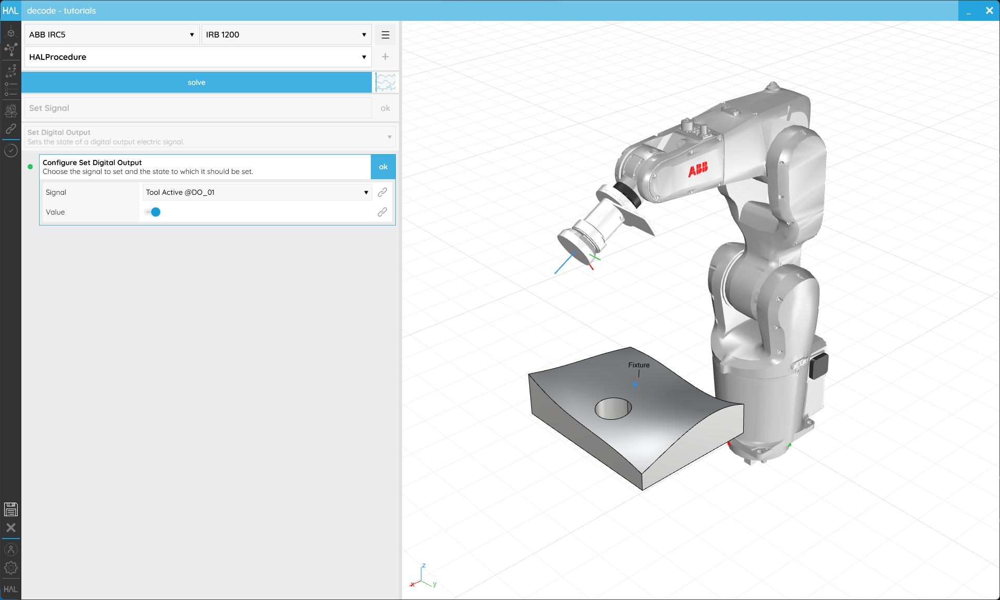](../../assets/images/decode/03-Programming/Programming-SetSignal-Complete.png) 
<em>Signals can be used to activate or deactivate Tools or trigger actions.</em>

You'll have a _Creator_ for each type of [Signal](../../Overview/Glossary.md#signal) available, e.g. **Set Digital Output** or **Set Analog Output**. Within each you will find a list of the relevant [Signals](../../Overview/Glossary.md#signal) in your **Network** and a _Value_ which should be assigned.

Once you are happy with the [Signal Action](../../Overview/Glossary.md#signal-action)'s setup, ensure the name makes it easy to identify and click **ok** in the upper right corner to return to the **Programming** screen.

---
### 3.4. Paths

#### Objective:

In this tutorial we'll see how to combine different [Procedures](../../Overview/Glossary.md#procedure) to chain sequences using the HAL Robotics Framework for Grasshopper.

#### Requirements to follow along:

- HAL Robotics _decode_ installed on a PC. See [Installation](../../Overview/0-Administration-and-Setup/Contents.md#01-install) if you need to install the software.
- An open [project](../1-Getting-Started/Contents.md#11-projects)
- A [Robot](../../Overview/Glossary.md#manipulator) in the **Scene**
- A [Controller](../../Overview/Glossary.md#controller) in the **Scene**
- A [CAD Model](../2-Cell/Contents.md#24-create-a-part) in the **Scene**

#### Background:

Building [Procedures](../../Overview/Glossary.md#procedure) [Action](../../Overview/Glossary.md#action) by [Action](../../Overview/Glossary.md#action) might be sufficient for some processes but longer Toolpaths can more easily be generated based on some sort of geometry, be that curves, surfaces or meshes. **Paths** allow exactly that including options for triggering sub-[Procedures](../../Overview/Glossary.md#procedure) and jumping between different sections of the **Path**.

#### How to:

From the **Programming** screen, select the [Group](#36-structuring-procedures) into which you want to add your new **Path**, or click anywhere in the white space to clear your current selection. You can always drag and drop [Actions](../../Overview/Glossary.md#action) onto [Groups](#36-structuring-procedures) or in between other [Actions](../../Overview/Glossary.md#action) to restructure your [Procedure](../../Overview/Glossary.md#procedure) later. Either of those states will enable the _Item Type_ selector to list **Path** as an option. Click **+** and you'll start creating a **Path**.

There are two _Creators_ in **Path**, **Follow Curve** and **Follow Pattern**. The former allows you to select or create curves within your **Scene** whilst the latter uses curves, surfaces or meshes as input regions that can be filled with a pattern. After that first **Curve** or **Pattern** creation section, the _Creators_ then follow exactly the same structure.

##### Follow Curve

There are lots of different ways to assign curves for the **Path** to follow, grouped in the **Source** setting. If you want to follow the edge of a CAD Model you have in your **Scene**, **From Model** lets you select that geometry. In the **From Model** settings you'll find a selector which allows you to add or remove curves to a collection. Click on **select** and then the **+** button in the pop-up to start selecting. Any eligible curves within your model will be highlighted when you hover over them and a single click will add them to the selection. You will see a banner appear above your 3D viewport which has extra information about the next step in the selection process, in this case how to confirm your selection and return to the pop-up. All the curves you selected will be listed here and can be individually removed using the **X** next to each item, or all cleared with the **X** next to he **+** button. You can return to adding or removing curves from the model by clicking the **+** again. When you're happy with your selection click **ok** and you'll be returned to the **Path** editor.

[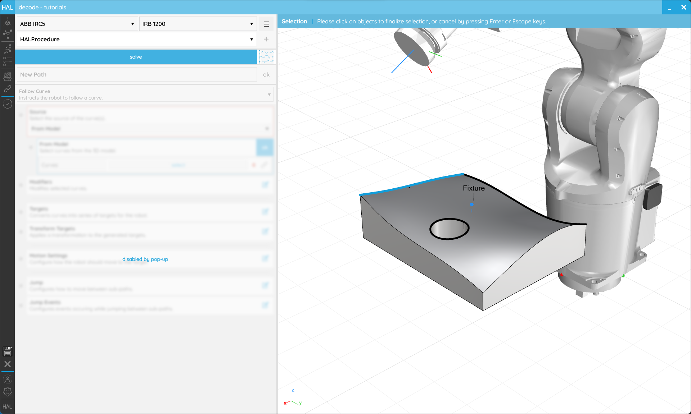](../../assets/images/decode/03-Programming/Programming-FollowCurve-FromModel-Selector.png) 
<em>You can select the edges of CAD Models to get your Robots to follow them.</em>

The other **Sources** allow you to create curves on any CAD Models you have imported. They will all ask you for one or more **Host** **Locations** which can be selected on any CAD Model in your **Scene**, and then a series of relevant **Settings**. There lots of possibilities here so it's well worth experimenting with all the options to see what can be achieved. For example from the **Spiral** _Source_, setting the _Inner Radius_ and _Outer Radius_ to the same value (maybe even a [Variable](../1-Getting-Started/Contents.md#14-variables)), and deactivating **Flat**, will allow you to create a cylindrical spiral at some point(s) on your CAD Model. Or linking your **Location(s)** to a [Variable](../1-Getting-Started/Contents.md#14-variables) will allow you to apply several different curves to the same locations.

[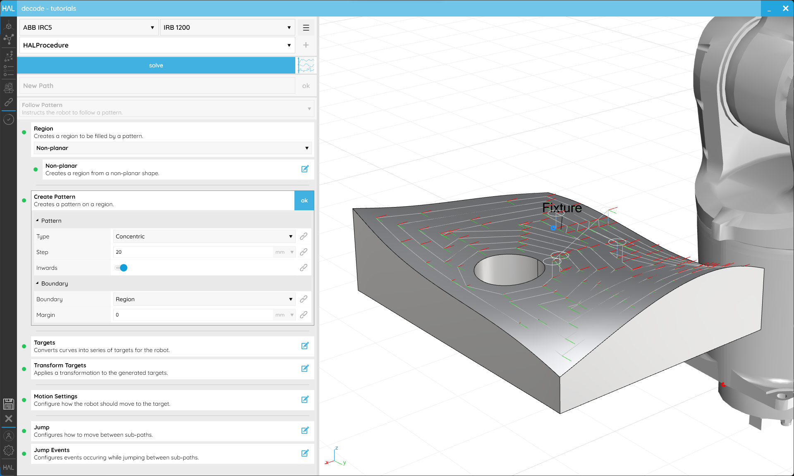](../../assets/images/decode/03-Programming/Programming-FollowPattern-NonPlanar-Concentric.png) 
<em>Complex curves can be generated all over your CAD Models.</em>

The **Modifiers** then allow you to manipulate those curves, _Flipping_ their direction to control which way the [Robot](../../Overview/Glossary.md#manipulator) [Moves](../../Overview/Glossary.md#motion-action) along them, _Extending_ them to over shoot (or using negative values to inset the start and end points). For **From Model** curves, _Join_ determines whether curves whose ends touch should be considered as a single joined curve or not and _Preserve Direction_ adds a little extra control over when that joining is applied.

##### Follow Pattern

Both **Follow Pattern** _Creators_ require some means of defining a **Region** to work. _Planar_ requires the selection of _Boundary_ curves from a CAD Model. Those can either be independent closed regions or one inside another which will be treated as holes within the outermost region. _Non-Planar_ regions need a surface or mesh from a CAD Model. It's best to explode complex models into their usable surfaces or meshes in your CAD editor of choice before importing them to make this easier. If you have curves within you CAD Models you can also set these are _Boundaries_ on the _Host_ surfaces but if no _Boundaries_ are specified we'll the edges of those surfaces in their stead.

[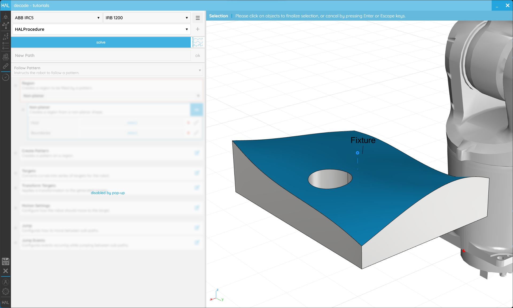](../../assets/images/decode/03-Programming/Programming-FollowPattern-NonPlanar-Selector.png) 
<em>Managing the separate surfaces in your original CAD file will make selection easier.</em>

With a **Region** in place, we can **Create a Pattern**. The _Pattern Type_ will determine the settings available so, again, it's worth experimenting to see what they all do. All _Pattern Types_ work well on _Planar_ **Regions** but we only recommend _Concentric_ or _Parallel_ on _Non-Planar_ **Regions**.

 
<em>Entire surfaces, including non-planar ones, can be covered in patterns.</em>

##### Target Generation

The **Targets** _Step_ allows you to decide how the geometry we have no selected or created should be subdivided into [Moves](../../Overview/Glossary.md#motion-action). The _Subdivision_ _Method_ allows you to decide how the inputs should be approximated whilst the _Tolerance_ allows you to specify how accurately the input should be followed. A larger _Tolerance_ value will allow greater deviation from the input but will result in fewer [Targets](../../Overview/Glossary.md#target). Whilst it might seem desirable to make that as low as possible, having too many [Targets](../../Overview/Glossary.md#target) will generate lots of code and may have a negative impact on [Robot](../../Overview/Glossary.md#manipulator) performance. The **Guide** settings allow you to automatically orient your [Targets](../../Overview/Glossary.md#target) to follow some geometry. For example if you were applying a _Pattern_ to a surface, the _Guide_ would enable you to keep all your [Targets](../../Overview/Glossary.md#target) normal (perpendicular) to that surface, or if you have selected curves **From Model** you could keep one of the axes tangent to them (_Use Curve As Guide_).

[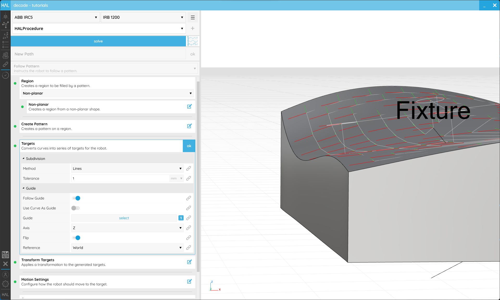](../../assets/images/decode/03-Programming/Programming-FollowPattern-NonPlanar-Guide.png) 
<em>Targets can be aligned to a guide surface to maintain perpendicularity to that surface.</em>

**Transform [Targets](../../Overview/Glossary.md#target)** allows you to offset your [Targets](../../Overview/Glossary.md#target) uniformly. This is applied relative to the [Target](../../Overview/Glossary.md#target) itself when in _Parent_ or to the _World_ when the Reference is set to the _World_. If for example you had a pattern across a surface with all of your [Targets](../../Overview/Glossary.md#target)' Z-axes facing into that surface, you could moving them all off the surface by 20mm by setting the _Position Z_ value to `-20` (minus because it's in the opposite direction to the Z axis). Or you could rotate all of your [Targets](../../Overview/Glossary.md#target) around their X-axes by changing the _Rotation X_ value.

[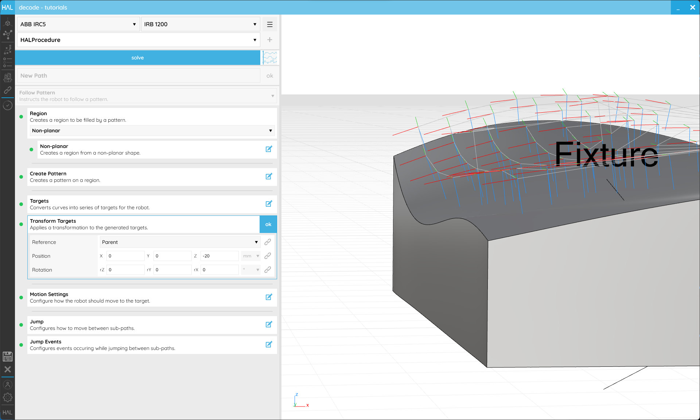](../../assets/images/decode/03-Programming/Programming-FollowPattern-NonPlanar-Transform.png) 
<em>Targets can be offset to create spacing between a Part and the Tool.</em>

##### Motion

**Motion Settings** are exactly the same as you will have seen in the [Move](#31-move) tutorial.

##### Jumps

It's possible that your **Path** is a single continuous sequence of [Targets](../../Overview/Glossary.md#target), but if there are breaks in it **Jumps** allow you to specify how the [Robot](../../Overview/Glossary.md#manipulator) should get from the end of one sequence to the start of the next. There are 5 phases to the **Jump** _Step_ that can all be controlled by the same settings or specified individually.
- **Path Entry** specifies where the [Robot](../../Overview/Glossary.md#manipulator) should [Move](../../Overview/Glossary.md#motion-action) to before the start of the first sequence.
- **Path Exit** specifies where the [Robot](../../Overview/Glossary.md#manipulator) should [Move](../../Overview/Glossary.md#motion-action) to after the end of the last sequence.
- **Jump Start** specifies where the [Robot](../../Overview/Glossary.md#manipulator) should [Move](../../Overview/Glossary.md#motion-action) to after the end of any other sequence.
- **Jump End** specifies where the [Robot](../../Overview/Glossary.md#manipulator) should [Move](../../Overview/Glossary.md#motion-action) to before the start of any other sequence.
- **Jump Travel** dictates how the [Robot](../../Overview/Glossary.md#manipulator) [Moves](../../Overview/Glossary.md#motion-action) between **Jump Start** and **Jump End**.

The settings within each of those phases should be familiar by now.

[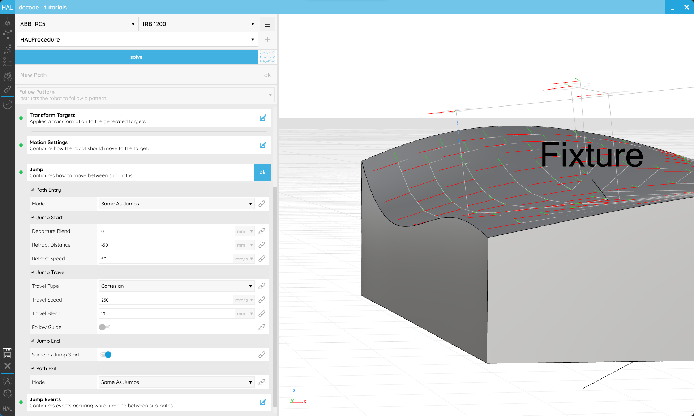](../../assets/images/decode/03-Programming/Programming-FollowPattern-NonPlanar-Jumps.png) 
<em>Jumps allow you to control how the Robot gets between segments of your Toolpath.</em>

**Jump Events** allow you to specify if anything should happen during the **Path** or its **Jumps**. That could include activating or deactivating a Tool, triggering a Signal or a Wait. They are all [Procedure](../../Overview/Glossary.md#procedure) **Calls** and therefore need to be created within sub-Procedures. See [Structuring Procedures](#36-structuring-procedures) for more details about how those are created.

- **Entry** **On Approach** is called at the **Path Entry** [Target](../../Overview/Glossary.md#target).
- **Entry** **On Start** is called at the first [Target](../../Overview/Glossary.md#target) of the first sequence only.
- **Jumps** **On Departure** is called at the last [Target](../../Overview/Glossary.md#target) of each sequence.
- **Jumps** **On Retract** is called at the **Jump Start** point of each sequence.
- **Jumps** **On Travel** is called at the **Jump End** point of each sequence.
- **Jumps** **On Arrival** is called at the first [Target](../../Overview/Glossary.md#target) of each sequence.
- **Exit** **On End** is called at the last [Target](../../Overview/Glossary.md#target) of the last sequence only.
- **Exit** **On Retract** is called at the **Path Exit** [Target](../../Overview/Glossary.md#target).

Once you are happy with the **Path**'s setup, ensure the name makes it easy to identify and click **ok** in the upper right corner to return to the **Programming** screen.

---
### 3.5. Custom Actions

#### Objective:

In this tutorial we'll use a [Custom Action](../../Overview/Glossary.md#custom-action) to trigger an existing [Robot](../../Overview/Glossary.md#manipulator) function using _decode_.

#### Requirements to follow along:

- HAL Robotics _decode_ installed on a PC. See [Installation](../../Overview/0-Administration-and-Setup/Contents.md#01-install) if you need to install the software.
- An open [project](../1-Getting-Started/Contents.md#11-projects)
- A [Robot](../../Overview/Glossary.md#manipulator) in the **Scene**
- A [Controller](../../Overview/Glossary.md#controller) in the **Scene**

#### Background:

When working with a fully integrated [Cell](../../Overview/Glossary.md#cell) or using a [Robot](../../Overview/Glossary.md#manipulator) with pre-built functionality which isn't natively supported by the HAL Robotics Framework, you may want add code to your export which calls an existing function in the [Controller](../../Overview/Glossary.md#controller). We do this using [Custom Actions](../../Overview/Glossary.md#custom-action). Common for [Custom Actions](../../Overview/Glossary.md#custom-action) are opening or closing a gripper, running tool change procedures, starting logging, activating collision boxes, popping up messages to the operator etc.

#### How to:

From the **Programming** screen, select the [Group](#36-structuring-procedures) into which you want to add your new [Custom Action](../../Overview/Glossary.md#custom-action), or click anywhere in the white space to clear your current selection. You can always drag and drop [Actions](../../Overview/Glossary.md#action) onto [Groups](#36-structuring-procedures) or in between other [Actions](../../Overview/Glossary.md#action) to restructure your [Procedure](../../Overview/Glossary.md#procedure) later. Either of those states will enable the _Item Type_ selector to list [Custom Action](../../Overview/Glossary.md#custom-action) as an option. Click **+** and you'll start creating a [Custom Action](../../Overview/Glossary.md#custom-action). 

The main thing required here is our _Code_. This should just be the textual representation of the code that you want to export. For example if you wanted to create a pop-up message on an ABB robot you could write _TPWrite "Hello Robot";_ and that exact line of code will be exported within your program.

Other than the _Name_, which we recommend always setting, the other setting is _Simulation_. This allows you to select a [Procedure](../../Overview/Glossary.md#procedure) which will change how this [Action](../../Overview/Glossary.md#action) is simulated but won't affect how it's [Exported](../../Overview/Glossary.md#export). If you know it's going to take a second for your gripper to close, for example, you could put a [Wait](../../Overview/Glossary.md#wait-action) [Action](../../Overview/Glossary.md#action) in a [sub-procedure](#36-structuring-procedures), assign it to your _Simulation_ and the program will pause when simulated but the code won't contain any [Wait](../../Overview/Glossary.md#wait-action) instructions.

Once you are happy with the [Custom Action](../../Overview/Glossary.md#custom-action)'s setup, ensure the name makes it easy to identify and click **ok** in the upper right corner to return to the **Programming** screen.

---
### 3.6. Structuring Procedures

#### Objective:

In this tutorial we'll see how to simplify your programming by structuring your [Procedures](../../Overview/Glossary.md#procedure) in _decode_.

#### Requirements to follow along:

- HAL Robotics _decode_ installed on a PC. See [Installation](../../Overview/0-Administration-and-Setup/Contents.md#01-install) if you need to install the software.
- An open [project](../1-Getting-Started/Contents.md#11-projects)
- A [Robot](../../Overview/Glossary.md#manipulator) in the **Scene**
- A [Controller](../../Overview/Glossary.md#controller) in the **Scene**

#### Background:

Once your [Procedures](../../Overview/Glossary.md#procedure) start to get more complex, you will likely find that certain sequences of [Actions](../../Overview/Glossary.md#action) are repeated. That could include moving the [Robot](../../Overview/Glossary.md#manipulator) to a home position, (de)activating a [Tool](../../Overview/Glossary.md#end-effector) or setting some collection of Signals. Even if those sequences aren't repeated, it may help the legibility of your [Procedures](../../Overview/Glossary.md#procedure) to create a hierarchy to collect [Actions](../../Overview/Glossary.md#action) into logical groups. We have two ways of doing that in _decode_, **Groups** and [Procedure](../../Overview/Glossary.md#procedure) Calls.

#### How to:

From the **Programming** screen, click in some white space to clear your selection. The _Item Type_ selector should now list **Group** and **Call**.

Starting with **Group**, click **+** and we'll enter the **Group** editor. There are no settings in here other than the name so set one that makes it easy to identify and click **ok** in the upper right corner to return to the **Programming** screen. If you then select your new **Group** you'll see that any [Action](../../Overview/Glossary.md#action) can be created within it or existing [Actions](../../Overview/Glossary.md#action) can be dragged in or out of it. That's all there is to **Groups**, they're there to help you keep [Procedures](../../Overview/Glossary.md#procedure) organised.

[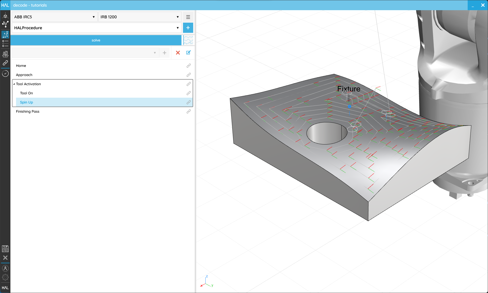](../../assets/images/decode/03-Programming/Programming-Groups.png) 
<em>Groups can help to structure longer Procedures.</em>

[Procedure](../../Overview/Glossary.md#procedure) Calls, however, are a little more involved. Before we can use one we'll need a sub-[Procedure](../../Overview/Glossary.md#procedure) to call. In the top right-hand corner you'll see another **+** button and a three bar menu (**☰**). Either of those can be used to add a new Procedure, and the menu can also be used to rename or delete your additional [Procedures](../../Overview/Glossary.md#procedure). As usual give this [Procedure](../../Overview/Glossary.md#procedure) an identifiable name, add some [Actions](../../Overview/Glossary.md#action) and then use the [Procedure](../../Overview/Glossary.md#procedure) selector to return to your main [Procedure](../../Overview/Glossary.md#procedure). 

 
<em>Sub-Procedures allow you to create reusable blocks of code.</em>

Once back in your main [Procedure](../../Overview/Glossary.md#procedure)'s editor, with a **Group** or nothing selected, select **Call** from the _Item Type_ selector and click **+** to add one. The default _Creator_ has a **Configure** _Step_ which will allow you to select which [Procedure](../../Overview/Glossary.md#procedure) you want to call. This will automatically rename your **Call**. Once you are happy with the **Call**'s setup click **ok** in the upper right corner to return to the **Programming** screen.

[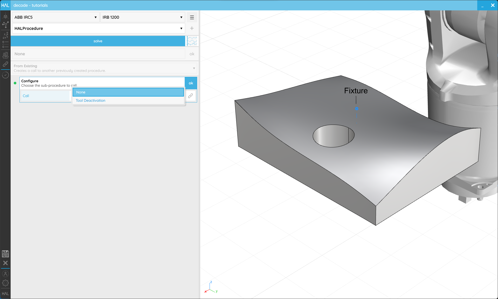](../../assets/images/decode/03-Programming/Programming-CallProcedure.png) 
<em>Procedure Calls allow you to reuse sub-Procedures e.g. to deactivate a Tool.</em>

---
### 3.7. Validation and Simulation

#### Objective:

In this tutorial we'll see how to Simulate our [Procedure](../../Overview/Glossary.md#procedure) in _decode_ to ensure it does what we expect.

#### Requirements to follow along:

- HAL Robotics _decode_ installed on a PC. See [Installation](../../Overview/0-Administration-and-Setup/Contents.md#01-install) if you need to install the software.
- An open [project](../1-Getting-Started/Contents.md#11-projects)
- A [Robot](../../Overview/Glossary.md#manipulator) in the **Scene**
- A [Controller](../../Overview/Glossary.md#controller) in the **Scene**
- Some [Actions](../../Overview/Glossary.md#action) in your main Procedure

#### Background:

There are scenarios in which a single [Robot](../../Overview/Glossary.md#manipulator) may have access to multiple [Tools](../../Overview/Glossary.md#end-effector) and the ability to change which [Tool](../../Overview/Glossary.md#end-effector) is in use at runtime. This could be because, either, the [Tool](../../Overview/Glossary.md#end-effector) itself has multiple [Endpoints](../../Overview/Glossary.md#endpoint) or because automatic [Tool](../../Overview/Glossary.md#end-effector) changing equipment is available in the [Cell](../../Overview/Glossary.md#cell).

#### How to:

In the **Programming** screen, between the [Procedure](../../Overview/Glossary.md#procedure) selector and the _Item Type_ selector you should see a large blue **solve** button. Clicking that will run a very fast simulation behind the scenes during which _decode_ will work out how the [Robot](../../Overview/Glossary.md#manipulator) is going to follow any Toolpaths you've created and check for potential issues. If your [Procedure](../../Overview/Glossary.md#procedure) is solved that button will be replaced by a **simulation control bar** with **reset**, **play**/**pause**, **next**, **previous**, and **loop** buttons as well as a **time ratio** slider to change the playback speed of the simulation. This won't change the programmed or exported speeds, it's just like skipping faster or slower through time. On the far right-hand side of that bar is a button with some graphs. That will open the [Procedure](../../Overview/Glossary.md#procedure) Timeline which will show you the details of your [Robot](../../Overview/Glossary.md#manipulator)'s [Motion](../../Overview/Glossary.md#motion-action) and highlight any issues during the [Procedure](../../Overview/Glossary.md#procedure).

[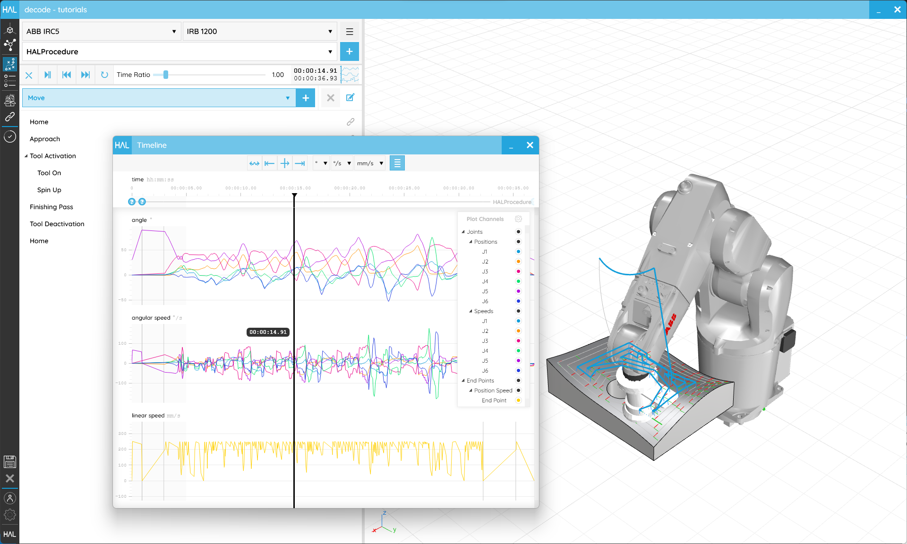](../../assets/images/decode/03-Programming/Programming-Solved-Timeline-Middle.png) 
<em>Solving the Procedure triggers the validation of the Procedure and allows its simulation.</em>

Every time you make a change to anything in your [Procedure](../../Overview/Glossary.md#procedure) you'll need to re-**solve** but we'll remember what happened last time so subsequent **solve**s will be faster.

---

[Continue to: 4. Operator Workflows](../4-Workflows/Contents.md#4-operator-workflows)