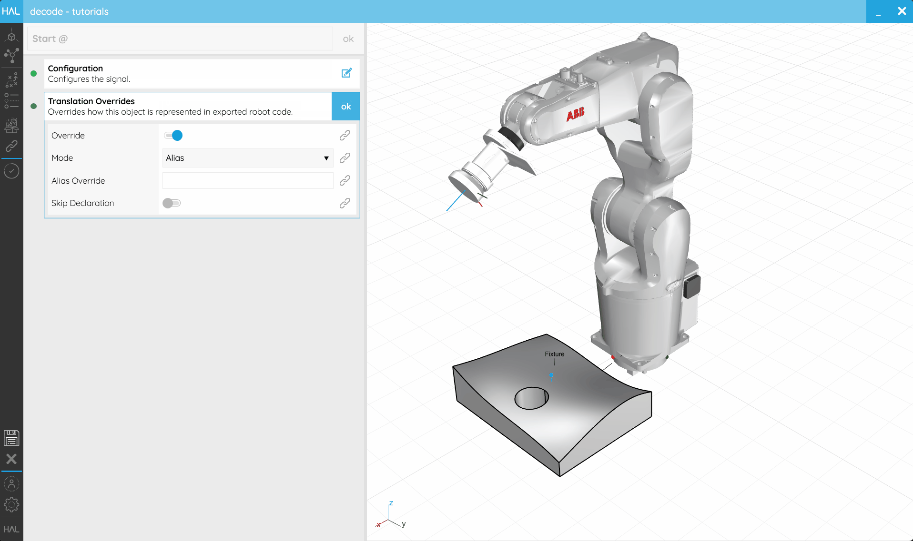

## 5. Advanced Programming

[5.1. External Variables](#51-external-variables)

[5.2. Procedures from Variables](#52-procedures-from-variables)

[5.3. Geometry from Variables](#53-geometry-from-variables)

[5.4. Reusing Controller Data](#54-resuing-controller-data)

---
### 5.1. External Variables
#### Coming Soon

---
### 5.2. Procedures from Variables
#### Coming Soon

---
### 5.3. Geometry from Variables
#### Coming Soon

---
### 5.4. Reuse Controller Data

#### Objective:

In this tutorial we'll explore some advanced syntax which allows you to reference data and variables which are already declared on your [Controller](../../Overview/Glossary.md#controller) or rename variables you [Export](../../Overview/Glossary.md#export) using the HAL Robotics Framework.

#### Background:

When your [Robot](../../Overview/Glossary.md#manipulator) and, more importantly, its [Controller](../../Overview/Glossary.md#controller) were installed, it's possible that certain [Tools](../../Overview/Glossary.md#end-effector) were calibrated and stored in the [Controller's](../../Overview/Glossary.md#controller) system variables or that it would be helpful to name [Signals](../../Overview/Glossary.md#signal) so they're immediately identifiable (e.g. _ToolOn_) but that they're named differently in your [Controller](../../Overview/Glossary.md#controller) or even that your [Robot's](../../Overview/Glossary.md#manipulator) language doesn't allow you to name [Signals](../../Overview/Glossary.md#signal) at all. We have therefore given you the option of overriding the way elements are [Exported](../../Overview/Glossary.md#export). These are generally useful for [Tools](../../Overview/Glossary.md#end-effector), [References](../../Overview/Glossary.md#reference) and [Signals](../../Overview/Glossary.md#signal) but can be used for [Targets](../../Overview/Glossary.md#target), [Motion Settings](../../Overview/Glossary.md#motion-action) or any other declarable type.

#### How to:

These overrides are all done through the naming of objects, by using special syntax in their _Aliases_, activated or deactivated using the **Translation Overrides** _Step_. There are 3 scenarios we permit:
1. Forcing the declaration of the element, even in `Inline` mode, e.g. so you can make manual changes to the code later. 
2. Skipping the declaration of the element, e.g. because it's already in the [Controller's](../../Overview/Glossary.md#controller) system variables and you want to use that data directly.
3. Renaming the element, e.g. the [Signal](../../Overview/Glossary.md#signal) which you have called _ToolOn_ for legibility is actually called _DO-04_ or is index _3_ on the real [Controller](../../Overview/Glossary.md#controller).
4. [Bonus] A combination of the above.

Overriding can be activated in the **Translation Overrides** _Step_ of compatible items by toggling **Override** on. You will then see a few options appear. **Mode** can be set between **Alias** and **Index**. The former will allow you to specify a new name for the item when it's exported. If the **Alias Override** is left blank, we will reuse the _Name_ specified in the object itself. In **Index** mode, we will try to [Export](../../Overview/Glossary.md#export) the **Index** within an array in the native language e.g. `Tool[3]`. If **Skip Declaration** is activated, then we will _not_ [Export](../../Overview/Glossary.md#export) any values for the item and assume that it is defined in your [Controller's](../../Overview/Glossary.md#controller) system variables.

<em>Translation overrides give you extra control over how items are exported to your robot code.</em>

The syntax you will see is as follows:
1. Declare an override - Appends `@` to the _Alias_
2. Skip declaration - Appends `!` to the _Alias_
3. Renaming - Appends the new name to the _Alias_

Examples:

| Code                 | Description                                                                                   |
| -------------------- | --------------------------------------------------------------------------------------------- |
| `MyTool`             | Regular tool declaration.                                                                     |
| `MyTool@`            | Forces the declaration of the tool.                                                           |
| `MyTool@toolData32`  | Forces the declaration of the tool, as a tool variable called toolData32.                     |
| `MyTool@!`           | No declaration – considers that a "MyTool" tool declaration already exists in the controller. |
| `MyTool@!toolData32` | No declaration – use the toolData32 tool variable from the controller.                        |

---